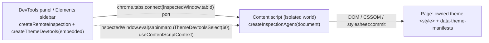

# @sabinmarcu/theme-devtools-extension

Chrome DevTools extension (Manifest V3) for editing live `@sabinmarcu/theme-core` source values on any page that embeds theme manifests. It adds:

- a **Theme** panel listing every discovered theme target, and
- a **Theme** sidebar pane in the Elements panel listing only targets whose allocation root contains the selected element (`$0`).

Both render the native inspector from [`@sabinmarcu/theme-devtools-core`](../../workspaces/libs/theme-devtools-core/README.md) in `embedded` presentation over a remote inspection. Edits commit to the application's own stylesheet; nothing is persisted and a reload restores the server-rendered values.

## Build and load (unpacked)

```sh
yarn moon run theme-devtools-extension:build   # or: yarn workspace @sabinmarcu/theme-devtools-extension build
```

1. Open `chrome://extensions`, enable **Developer mode**.
2. **Load unpacked** → select `apps/theme-devtools-extension/dist`.
3. Open DevTools on a page that embeds manifests and select the **Theme** panel, or the **Theme** tab beside Styles in Elements.

`yarn workspace @sabinmarcu/theme-devtools-extension dev` rebuilds the extension pages on change; reload the extension in `chrome://extensions` afterwards. The content script is only rebuilt by `build`.

## Making a page inspectable

The page must render its theme stylesheet and the inert manifest block discovered by `createThemeInspection`:

```ts
import { embedThemeManifests, serializeThemeManifests } from '@sabinmarcu/theme-core';

embedThemeManifests([setup.manifest()], { nonce });   // complete <script> HTML string
serializeThemeManifests([setup.manifest()]);          // escaped JSON body only (e.g. React)
```

The website emits it while the `themeDevtools` experiment is enabled (cookie `experiment-themeDevtools=true`). After client-side catalog changes, use the inspector's refresh button.

## Architecture



- `src/devtools.ts` registers the panel (`panel.html`) and the Elements sidebar pane (`sidebar.html`).
- `src/inspector.ts` (shared by both pages) connects a port per page, mirrors the page through `createRemoteInspection`, injects `content.js` with `chrome.scripting` when the page predates the extension, and reconnects on navigation or disconnect.
- `src/content.ts` runs one `createInspectionAgent` per connected port in the content-script isolated world (DOM access only; no page JavaScript, no custom elements) and exposes `sabinmarcuThemeDevtoolsSelect` for the sidebar's selection updates.
- `vite.config.ts` builds the extension pages; `vite.content.config.ts` builds `content.js` as a self-contained classic script.

Permissions: `scripting` and `<all_urls>` host access so the content script can run on any inspected page.

## Limitations

- Top frame only; themes inside iframes are not inspected.
- The sidebar filters by allocation-root containment only. It does not yet resolve which family member or light/dark variant applies to the selected element ([#46](https://github.com/sabinmarcu/omnirepo/issues/46)).
- DevTools sessions without an inspected tab (for example remote-debugging clients) cannot connect.
- Not published to the Chrome Web Store.
