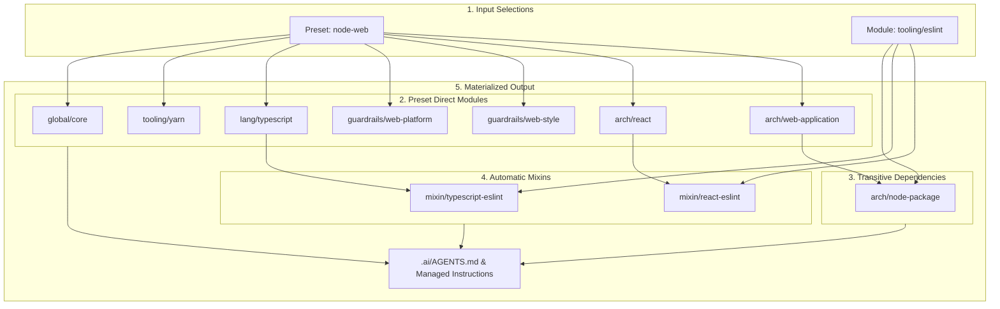
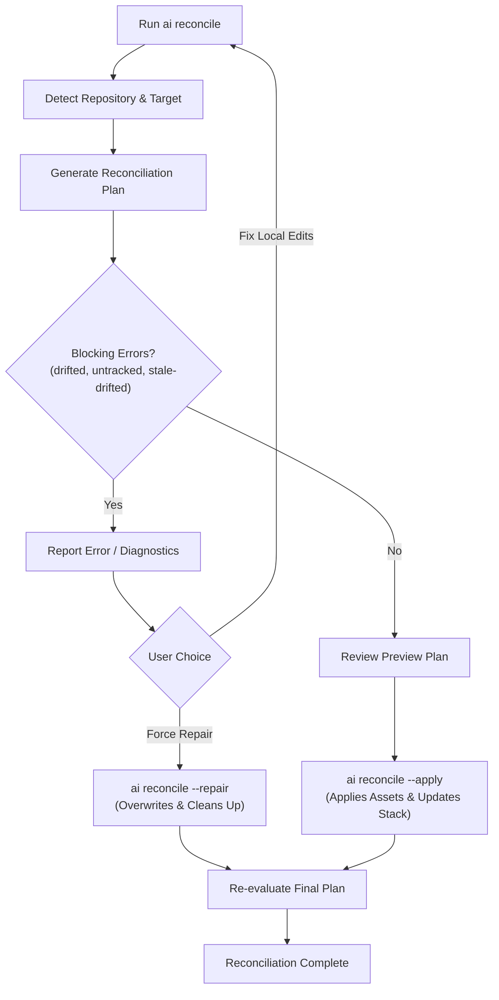
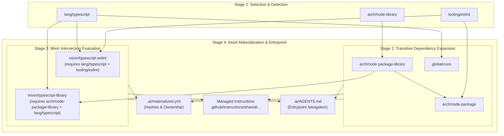

export const title = 'AI Library'
export const slug = 'ai-lib'
export const kind = 'CLI'
export const status = 'active'
export const repo = 'https://github.com/sabinmarcu/ai'
export const tags = ['project:kind:cli', 'project:status:active', 'lang:typescript', 'tool:node-js', 'tool:react', 'tool:ink', 'tool:copilot', 'topics:ai', 'topics:ai:agents', 'topics:ai:skills']
export const createdAt = '07.09.2026'
export const modifiedAt = '07.09.2026'

AI coding instructions tend to accumulate one repository at a time. A TypeScript rule gets copied into several projects, a linting workflow changes in one of them, and the copies gradually disagree. A single shared document avoids some duplication, but cannot express every combination of application architecture, language, and tooling without making each repository read rules it does not need.

ai-lib is a TypeScript CLI and catalog for composing that guidance. It selects modules appropriate to a repository, resolves their dependencies, activates rules for particular module combinations, and installs the resulting instructions and skills as local files. The package is named `@sabinmarcu/ai`; its executable is `ai`.

## What it manages

The catalog contains guidance rather than an AI model or an inference service. Its modules describe concerns such as Node.js project architecture, TypeScript, React, Yarn, ESLint, Git hooks, and commit conventions. Source assets include agent instructions and skills that explain how to work with those concerns.

Applying a stack writes the selected AI assets and a managed entrypoint. It does not, by itself, install ESLint, rewrite application code, or perform every setup step described by a skill. Those instructions are consumed by a coding agent working in the target repository.

The distinction matters: ai-lib makes the instruction set reproducible and inspectable. It does not guarantee that an agent will follow it or that the resulting application configuration is correct.

## From repository evidence to an instruction set

Detection inspects repository structure and package information. A module can provide its own detector, which returns an applicability decision, a reason, and supporting evidence. This keeps the knowledge of what makes TypeScript or a particular tool relevant beside the module that supplies its guidance.

The selected stack is not the complete instruction set. A preset supplies a bundle of module IDs, and ordinary modules can depend on other modules. Resolution expands those dependencies and rejects incompatible selections. Mixins are evaluated afterwards: they activate only when every ordinary module they require is present.

For example, TypeScript guidance and ESLint guidance can stand independently. When both are selected, a TypeScript-and-ESLint mixin supplies the integration rules. It is not another option that the user must remember to select.

## Example resolution flow

A typical Node web application using TypeScript and ESLint illustrates how a stack is constructed. Selecting the `node-web` preset and adding `tooling/eslint` starts with two explicit inputs, which expand into eight effective modules and trigger two mixins automatically:



The workflow operates in distinct steps:
1. **Input Selections**: The user or detector requests the `node-web` preset and the `tooling/eslint` module.
2. **Preset Expansion**: `node-web` expands into its constituent modules (`lang/typescript`, `arch/react`, `arch/web-application`, `guardrails/web-platform`, `guardrails/web-style`, `tooling/yarn`, and `global/core`).
3. **Transitive Dependency Resolution**: `arch/web-application` and `tooling/eslint` both declare a dependency on `arch/node-package`, which is pulled into the effective module set automatically.
4. **Automatic Mixin Triggers**: The resolver evaluates registered mixin conditions against the effective module list. Because `lang/typescript` and `tooling/eslint` are both present, `mixin/typescript-eslint` activates. Similarly, `arch/react` and `tooling/eslint` activate `mixin/react-eslint`.
5. **Materialization**: All effective modules and active mixins write their source assets to target paths under `.github/instructions/shared/` and assemble `.ai/AGENTS.md`.

## Local files with recorded ownership

The normal asset mode materializes catalog assets into the consuming repository. The repository therefore retains its instructions without needing a live connection to ai-lib's source repository during everyday work.

Three files describe the installation:

| File | Responsibility |
| --- | --- |
| `.ai/stack.yml` | Selected presets and modules, stack format version, creation timestamp, and asset mode. |
| `.ai/materialized.yml` | Managed file paths, content hashes, owner IDs, owner types, and owner versions. |
| `.ai/AGENTS.md` | Links to the active instructions, skills, and repository-local override locations. |

A reference in the repository's root `AGENTS.md` directs agents to the managed entrypoint. Module and mixin assets retain provenance markers identifying their catalog owner and version.

Repository-specific tuning belongs in local override locations, not in shared copies. Recorded hashes allow the CLI to distinguish an upstream update from a local edit before replacing a file.

## Reconciliation as the repository changes

An instruction stack can become inaccurate even when nobody edits its files. Adding TypeScript, removing a tool, or changing a project's role changes which guidance applies.

Reconciliation compares the existing stack with a newly detected selection. Its plan includes selected and effective module changes, mixin activation changes, override-path changes, and managed-file issues. Applying the plan updates the materialized assets and saved stack, then ensures the root entrypoint reference exists.

This is not a blind reset to detection results. Existing presets remain selected, and explicitly selected modules without detectors are retained. Modules with detectors are reconsidered against the current repository.

## Boundaries

The default workflow vendors shared guidance; it does not require the consuming repository to import a runtime library. An alternative source mode links catalog assets in place, but requires those assets to live inside the target repository. It is useful when working on a catalog in the repository that consumes it, rather than as a pointer to an arbitrary external checkout.

The implementation also separates file synchronization from merging local changes. Drift is something to inspect and resolve deliberately, not text that can always be merged automatically. Controlled backporting of shared changes is a stated project goal; it is not a registered CLI command in the source described here.

# !!file CLI

## !slug cli

# CLI, installation, and reconciliation

The CLI operates on the current working directory. Run repository commands from the directory whose stack you intend to manage. Detection can report multiple targets in a monorepo; reconciliation chooses the target matching the current directory, falling back to the first detected target. It does not apply a separate stack to every discovered workspace in one invocation.

## Installation and source checkout

You need Git, Node.js, and Yarn before running the installation commands below. The package declares Node.js `>=22.18.0`; its development runtime is pinned to Node.js `26.5.0`, with Yarn `4.17.0`. For reproducing the development environment, use those pinned versions. Node.js provides the JavaScript runtime, and Yarn installs the dependencies needed to build and run the CLI.

Install Node.js from its [download page](https://nodejs.org/en/download) and configure Yarn using its [installation guide](https://yarnpkg.com/getting-started/install).

Once published, the package can be installed under its `@sabinmarcu/ai` name:

```sh !package
install @sabinmarcu/ai
```

The package is not yet published to npm, but will be soon. Until publication, clone and build the CLI from source:

```sh
git clone https://github.com/sabinmarcu/ai.git ai-lib
cd ai-lib
yarn install
yarn build
export PATH="$PWD/bin:$PATH"
```

The `PATH` change exposes `ai` in the current shell. Add the checkout's absolute `bin` path to your shell configuration for a persistent installation. Rebuild after updating the source, because the launcher executes `dist/cli.js`, not the TypeScript entrypoint.

The launcher is a POSIX shell script, so this setup assumes a Unix-like shell. It detects a Yarn Plug'n'Play checkout and supplies the corresponding loader while preserving the target working directory. Invoking `bin/ai` by absolute path is also supported.

Move into the repository you want to configure before initializing it. The following path is a placeholder for that repository:

```sh
cd /path/to/target-repository
ai --help
ai detect
ai init
ai status -v
```

`detect` is read-only. `init` is not: it detects applicable modules, resolves the stack, writes managed assets and stack state, and adds the root `AGENTS.md` reference. Review existing AI files and keep a recoverable copy of local changes before initialization. It is not an empty-file scaffolder or a dry run.

## Select a preset or additional modules

Presets express reusable bundles. The catalog's `node-web` preset combines web application, React, TypeScript, Yarn, platform, and styling guidance. For a repository that actually needs that combination:

```sh
ai init --preset node-web
```

Both `--preset` and `--module` may be repeated. Their short forms are `-p` and `-m`. Initialization runs reconciliation, so modules with detectors are reconsidered using repository evidence; an explicit module argument is not a permanent override of its detector. Preset selections are retained.

Use `init` for initial setup and `reconcile` for subsequent repository changes. Initialization constructs a new stack with a new creation timestamp; it is not an operation that simply appends options to the existing selection.

## Inspect the installation

| Command | What it inspects |
| --- | --- |
| `ai detect` | Repository targets, effective detected modules, and active mixins. Does not require a saved stack. |
| `ai status` | Saved stack resolution, mixin count, asset mode, and managed-file issues. |
| `ai status -v` | Adds active mixin IDs. |
| `ai status -vv` | Also shows catalog source paths. `--verbosity 0`, `1`, or `2` selects an explicit level. |
| `ai verify` | Parses the saved stack, loads the catalog, and checks that explicitly selected module IDs exist. |

`status` returns a nonzero exit code for unknown selected modules or presets, or for managed-file issues. With no stack, it reports that absence and returns zero. Do not use that exit code alone to prove that a repository has been initialized.

`verify` is narrower than its name might suggest: it does not inspect installed file contents or perform the full saved-stack resolution used by `status`. It is not a substitute for checking drift or incompatible selections.

## Review before reconciling

After adding or removing tools, changing dependencies, or updating the catalog used by the CLI:

```sh
ai reconcile
```

Without flags, this prints a plan and makes no changes. The plan reports modules, mixins, and managed-file diagnostics:



The preview returns zero even when its diagnostics contain errors; it is a review command, not a strict CI gate.

Detection refreshes detector-backed selections, preserves selected presets, and retains explicitly selected modules that have no detector. Dependencies and mixins are then recalculated from the proposed stack.

When the proposed changes are appropriate and no blocking issues remain:

```sh
ai reconcile --apply
```

This applies the assets, removes eligible stale files, writes the proposed stack, and ensures the root entrypoint link exists. It then creates another plan to check for unresolved changes or issues. Missing or outdated files can be handled by this normal path; edited files and unknown selected modules require attention first.

## Understand file diagnostics

Inspection compares three things: the desired catalog content, the previously recorded file hash, and the current file content.

| Diagnostic | Meaning |
| --- | --- |
| `missing` | A desired managed file is absent. |
| `outdated` | A previously installed file needs a catalog update, or its recorded hash or ownership metadata needs refreshing. |
| `drifted` | Current content differs from the desired content and cannot be treated as an unchanged previous installation. |
| `untracked` | A file exists at a desired managed path but has no ownership record. |
| `stale` | A recorded file is no longer in the desired plan and has not been locally modified, or is already absent. |
| `stale-drifted` | A recorded file is no longer wanted, but its current content differs from the recorded hash. |

`reconcile --apply` blocks on `drifted`, `stale-drifted`, and `untracked` files. It also blocks when selected module IDs have disappeared from the catalog. Preserve useful edits and move repository-specific changes into the applicable override location before deciding to replace managed files.

## Repair deliberately

```sh
ai reconcile --repair
```

Repair is a force operation. It can overwrite local content at managed paths, remove edited stale files, and drop unknown explicitly selected module IDs. It does not merge those edits or back them up. Review the preview and preserve anything you need before using it.

`--apply` and `--repair` are mutually exclusive. Repair is rejected when there are no blocking errors; ordinary missing or outdated files should use `--apply`. Unknown presets are not covered by the selected-module repair step.

There is also a lower-level operation:

```sh
ai apply
```

This materializes the existing saved selection without redetecting the repository. Unlike `reconcile --apply`, it can overwrite edited files already recorded as managed. It still refuses to overwrite a differing untracked file or remove an edited stale file. Use it when restoring the current stack is intentional, not as a synonym for a read-only status check or guarded reconciliation.

## Browse modules interactively

```sh
ai interactive
```

This requires an existing stack and an interactive terminal. It shows effective modules, dependency relationships, and reasons a module is selected. Search with `/`, move with the arrow keys or `j` and `k`, switch grouping with `t`, and quit with `q`.

The current interface is a browser, not a selection editor. Searching, navigating, and grouping do not change the saved stack or apply files.

## Source mode

For a repository that contains the catalog it consumes:

```sh
ai init --asset-mode source
```

Source mode loads the local `catalog` directory and links directly to its assets from `.ai/AGENTS.md`. The assets must be contained in the target repository. Only the entrypoint is materialized in this mode; catalog instructions and the reconciliation skill remain source links.

Normal consumers should use the default `materialized` mode. It copies the guidance into the repository and does not depend on keeping a separate catalog checkout available to the coding agent.

# !!file Architecture

## !slug architecture

# Architecture, modules, and mixins

ai-lib separates deciding which guidance applies from writing that guidance to disk. The catalog describes ownership and relationships. Detection produces repository evidence. Resolution turns a selection into an effective instruction set. Materialization produces files, while reconciliation compares the current installation with a newly proposed one.

## Implementation layers

| Source area | Responsibility |
| --- | --- |
| `src/cli.ts` and `src/commands/` | Clipanion command registration, options, output, and orchestration. |
| `src/components/` | React and Ink components for the interactive catalog browser. |
| `src/lib/catalog.ts` | JSON manifest loading, detector imports, and catalog validation with Zod. |
| `src/lib/detect.ts` | Repository and workspace discovery, detector contexts, and evidence collection. |
| `src/lib/resolve.ts` | Preset expansion, dependency ordering, conflict checks, and mixin activation. |
| `src/lib/materialize.ts` | File plans, provenance markers, SHA-256 hashes, inspection, and writes. |
| `src/lib/reconcile.ts` | Proposed stack selection and differences between current and desired state. |
| `src/lib/stack.ts` | YAML stack persistence and stack-format handling. |

These layers share typed data structures rather than relying on terminal output as an internal protocol. For example, a reconciliation plan contains both current and proposed resolutions, selected and effective module differences, active mixin changes, override-path differences, and a complete materialization plan.

## Modules own one concern

A module lives in `catalog/modules/<folder>/module.json`. Its stable `id` is the reference used by presets and stack state; it need not match the folder name. The manifest describes its name, version, category, dependencies, conflicts, source assets, managed destinations, and local override locations.

The TypeScript module is `lang/typescript`. It depends on `global/core`, owns shared instructions under `.github/instructions/shared/typescript/`, and points repository-local customization at `.github/instructions/local/typescript/`.

Its assets are separate documents covering TypeScript architecture, function-owned namespace types, scripts and builds, tsconfig layout, runtime validation, Node.js API typings, native execution, and testing. Keeping those assets separate does not make them separate selectable modules: selection is still at the manifest level.

`managedPaths` declares ownership, while `sourceAssets` lists the actual files to install. The materializer maps an asset such as `files/instructions/typescript-testing.instructions.md` into the module's managed instructions directory. `overridePaths` advertises where local guidance belongs; it does not itself create those files or implement a text-merging mechanism.

## Detection belongs beside the module

An optional `detect.mjs` file default-exports a detector. It receives the target's repository and project paths, optional package metadata, an `exists` helper, and a `dependency` helper.

The actual TypeScript detector is small:

```js detect.mjs
export default function detect({ dependency }) {
	const evidence = dependency('typescript');
	return {
		applies: evidence.length > 0,
		reason: 'The target declares TypeScript in its package manifest.',
		evidence,
	};
}
```

The dependency helper checks `dependencies`, `devDependencies`, `peerDependencies`, and `optionalDependencies`. A positive result carries both a decision and evidence suitable for explaining the selection. This detector does not infer TypeScript usage merely from a `.ts` file or a tsconfig file.

Repository discovery uses `@sabinmarcu/utils-repo` to locate the root and declared workspace paths. Each target is detected separately. Dependency lookup uses the target's parsed package manifest; it is not a lookup through the installed transitive dependency graph.

Detectors are executable JavaScript loaded through dynamic import, not sandboxed declarative expressions. A custom catalog must therefore be trusted as code as well as reviewed as guidance.

## Presets bundle, dependencies specialize

A preset is a named list of ordinary modules. The current web preset is:

```json node-web.json
{
	"id": "node-web",
	"name": "Node Web Application",
	"description": "Composable baseline for TypeScript-driven Node web projects.",
	"modules": [
		"global/core",
		"tooling/yarn",
		"lang/typescript",
		"guardrails/web-platform",
		"guardrails/web-style",
		"arch/react",
		"arch/web-application"
	]
}
```

A preset is not a snapshot of all installed files. The resolver still expands module dependencies and activates mixins. Repository-root policy, for example, is contextually detected rather than listed in this application preset.

An ordinary dependency expresses an unconditional relationship. `arch/node-library` depends on `arch/node-package-library`, which depends on `arch/node-package`. A Node.js library always needs the shared library publication and package guidance; that is not an optional intersection.

Resolution deduplicates and sorts requested IDs, then traverses sorted dependencies before each dependent module. It rejects unknown IDs, dependency cycles, and conflicts present in the effective set. For example, `arch/node-library` declares a conflict with `arch/web-library`; selecting both is not resolved by whichever was listed last.

## Mixins own combination-specific rules

A mixin lives under `catalog/mixins/<folder>/mixin.json`. Its `requiresAll` field names ordinary modules that must all be effective. Mixins cannot be put in presets or directly selected in stack state. They are derived after dependency resolution and do not create another dependency chain between mixins.

The TypeScript/ESLint mixin is a complete example:

```json mixin.json
{
	"id": "mixin/typescript-eslint",
	"name": "TypeScript ESLint Integration",
	"description": "TypeScript peer dependency and validation requirements for the shared ESLint configuration.",
	"version": "0.1.0",
	"managedPaths": [
		".github/instructions/shared/mixins/typescript-eslint/"
	],
	"sourceAssets": [
		"files/instructions/typescript-eslint.instructions.md"
	],
	"overridePaths": [
		".github/instructions/local/mixins/typescript-eslint/"
	],
	"requiresAll": [
		"lang/typescript",
		"tooling/eslint"
	]
}
```

TypeScript alone does not imply ESLint, and ESLint alone does not imply TypeScript. Their combination needs a particular integration: load `typescript-eslint` alongside the shared ESLint configuration, keep parser and plugin configuration owned by that baseline, and inspect the effective configuration for representative TypeScript files.

The mixin's instructions explicitly treat a missing optional peer as a setup failure even if the shared configuration silently skips TypeScript support. That rule belongs to neither ordinary module in isolation.

## Resolution pipeline and mixin activation example

To see the complete multi-stage architecture in action, consider a Node library project where detection identifies `arch/node-library`, `lang/typescript`, and `tooling/eslint`:



### Execution details per stage

1. **Stage 1 (Selection & Detection)**: The stack config or repository detector identifies primary requested modules (`arch/node-library`, `lang/typescript`, `tooling/eslint`).
2. **Stage 2 (Transitive Dependency Expansion)**: Resolution performs a depth-first traversal of `dependsOn` lists. `arch/node-library` pulls in `arch/node-package-library`, which pulls in `arch/node-package`. Duplicate dependencies are merged and validated for conflicts.
3. **Stage 3 (Mixin Intersection Evaluation)**: After ordinary modules are fully resolved, mixin conditions (`requiresAll`) are evaluated. Notice that `mixin/typescript-library` activates because `arch/node-package-library` was added during Stage 2 dependency expansion—mixins evaluate against the full *effective* module set, not just direct selections.
4. **Stage 4 (Asset Materialization & Entrypoint)**: Each effective module and active mixin contributes its source assets to disk. SHA-256 hashes and owner metadata (`ownerId` and `ownerVersion`) are indexed in `.ai/materialized.yml` for drift detection during future reconciliations, while `.ai/AGENTS.md` is compiled to reference all active instructions.

The library mixin aligns TypeScript emission with the library publication contract: `src` to `dist`, public declarations in `dist`, matching package type exports, and no tests or stories in the build output. When another builder owns emission, its configuration owns that contract instead of duplicating it in TypeScript.

After introducing the relevant dependencies into an existing repository, the operational workflow is:

```sh
ai detect
ai reconcile
ai reconcile --apply
ai status -v
```

Review the plan before applying it. No `--module mixin/typescript-eslint` argument is needed or accepted. If ESLint later leaves the effective set, that mixin deactivates; shared library guidance can remain. Existing presets or another module's dependencies may still keep a module effective, so removing a direct selection is not necessarily enough to deactivate it.

## Decide where a new rule belongs

Use a module for an independently applicable concern and a dependency when one concern always specializes another. Use a mixin when concrete behavior changes only at the intersection of multiple ordinary modules.

For example, invoking lint-staged from a Husky pre-commit hook belongs to `mixin/husky-lint-staged`: neither installing Husky nor configuring lint-staged alone implies that invocation. A general recommendation to use code quality tools is not enough to justify a mixin.

Inspect the dependency closure before adding an intersection rule. Otherwise a mixin can duplicate guidance that is already unconditionally inherited. Give each mixin its own managed destination rather than relying on ordering to overwrite a module's file.

## Ownership is explicit, not last-write-wins

Catalog loading validates manifest shapes, referenced IDs, source asset existence, relative paths, duplicate values, and dependency cycles. It rejects duplicate normalized managed-path declarations across modules and mixins. Materialization separately rejects two active owners producing the same target file.

This is not a generic deep merge of configuration objects. Each installed file has one owner, one owner version, and one desired content hash. A local override is a separate instruction location, not a patch silently applied to the shared asset.

Reconciliation uses those ownership records to plan additions, updates, and removals. Its write phase is sequential, not an atomic filesystem transaction with rollback. The CLI replans after applying to report remaining issues, but a failed write should still be inspected before retrying.

# !summary

A composable CLI and catalog for installing repository-local AI instructions and skills. It resolves modules and mixins, records managed-file ownership, and reconciles the instruction stack as a repository changes.