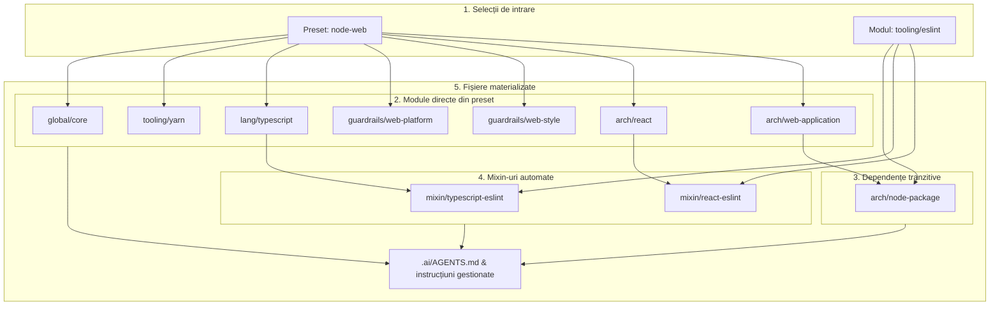
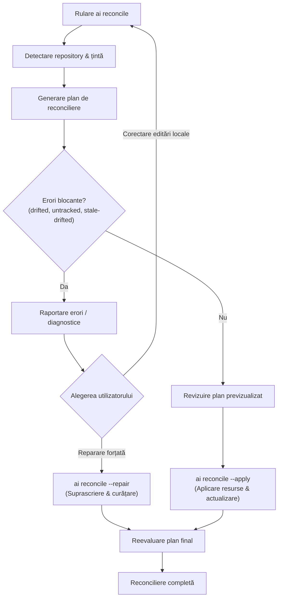
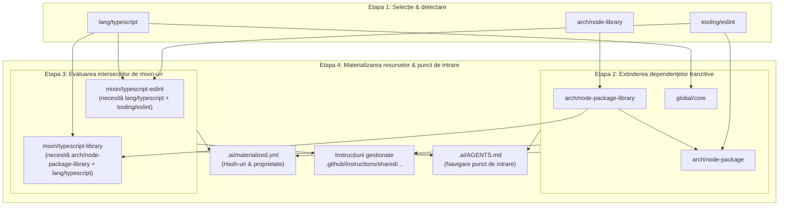

export const title = 'AI Library'
export const slug = 'ai-lib'
export const kind = 'CLI'
export const status = 'active'
export const repo = 'https://github.com/sabinmarcu/ai'
export const tags = ['project:kind:cli', 'project:status:active', 'lang:typescript', 'tool:node-js', 'tool:react', 'tool:ink', 'tool:copilot', 'topics:ai', 'topics:ai:agents', 'topics:ai:skills']
export const createdAt = '07.09.2026'
export const modifiedAt = '07.09.2026'

Instrucțiunile pentru agenții AI de programare tind să se acumuleze separat în fiecare repository. O regulă TypeScript este copiată în mai multe proiecte, un flux de linting se schimbă într-unul dintre ele, iar copiile ajung treptat să se contrazică. Un singur document comun reduce o parte din duplicare, dar nu poate exprima toate combinațiile de arhitectură, limbaj și instrumente fără să impună fiecărui repository reguli de care nu are nevoie.

ai-lib este un CLI TypeScript și un catalog pentru compunerea acestor instrucțiuni. Selectează modulele potrivite unui repository, le rezolvă dependențele, activează reguli pentru anumite combinații de module și instalează instrucțiunile și skill-urile rezultate ca fișiere locale. Pachetul se numește `@sabinmarcu/ai`, iar executabilul este `ai`.

## Ce gestionează

Catalogul conține instrucțiuni, nu un model AI sau un serviciu de inferență. Modulele sale acoperă arhitectura proiectelor Node.js, TypeScript, React, Yarn, ESLint, hook-uri Git și convenții pentru commit-uri. Fișierele sursă includ instrucțiuni și skill-uri care explică unui agent cum să lucreze cu aceste tehnologii.

Aplicarea unei configurații scrie fișierele AI selectate și un punct de intrare gestionat. Nu instalează, prin ea însăși, ESLint, nu rescrie codul aplicației și nu execută fiecare pas descris de un skill. Instrucțiunile sunt folosite de un agent care lucrează în repository-ul țintă.

Distincția contează: ai-lib face setul de instrucțiuni reproductibil și inspectabil. Nu garantează că un agent îl va respecta sau că aplicația rezultată va fi configurată corect.

## De la indicii din repository la un set de instrucțiuni

Detectarea inspectează structura repository-ului și informațiile despre pachete. Un modul poate furniza propriul detector, care întoarce o decizie de aplicabilitate, o explicație și dovezile folosite. Astfel, logica prin care TypeScript sau un anumit instrument devine relevant rămâne lângă modulul care îi furnizează instrucțiunile.

Configurația selectată nu reprezintă întregul set de instrucțiuni. Un preset furnizează o listă de ID-uri de module, iar modulele obișnuite pot depinde de alte module. Rezolvarea extinde aceste dependențe și respinge selecțiile incompatibile. Mixin-urile sunt evaluate după acest pas: se activează doar atunci când toate modulele obișnuite cerute sunt prezente.

De exemplu, instrucțiunile TypeScript și cele ESLint pot exista independent. Când ambele module sunt selectate, un mixin TypeScript și ESLint furnizează regulile de integrare. Nu este încă o opțiune pe care utilizatorul trebuie să-și amintească să o selecteze.

## Exemplu de flux de rezolvare

O aplicație web Node tipică ce folosește TypeScript și ESLint ilustrează modul în care este construită o configurație. Selectarea preset-ului `node-web` și adăugarea modulului `tooling/eslint` începe cu două intrări explicite, care se extind în opt module efective și activează automat două mixin-uri:



Fluxul funcționează în etape clare:
1. **Selecții de intrare**: Utilizatorul sau detectorul solicită preset-ul `node-web` și modulul `tooling/eslint`.
2. **Extinderea preset-ului**: `node-web` se extinde în modulele sale componente (`lang/typescript`, `arch/react`, `arch/web-application`, `guardrails/web-platform`, `guardrails/web-style`, `tooling/yarn` și `global/core`).
3. **Rezolvarea dependențelor tranzitive**: `arch/web-application` și `tooling/eslint` declară ambele o dependență de `arch/node-package`, care este adăugat automat în setul de module efective.
4. **Activarea mixin-urilor automate**: Rezolvitorul evaluează condițiile mixin-urilor înregistrate în raport cu lista modulelor efective. Deoarece `lang/typescript` și `tooling/eslint` sunt ambele prezente, `mixin/typescript-eslint` se activează. În mod similar, `arch/react` și `tooling/eslint` activează `mixin/react-eslint`.
5. **Materializarea**: Toate modulele efective și mixin-urile active își scriu fișierele sursă la căile țintă sub `.github/instructions/shared/` și asamblează `.ai/AGENTS.md`.

## Fișiere locale cu proprietar înregistrat

Modul implicit de gestionare a fișierelor materializează resursele catalogului în repository-ul consumator. Acesta își păstrează astfel instrucțiunile fără să aibă nevoie de o conexiune permanentă la repository-ul sursă ai-lib în timpul lucrului obișnuit.

Trei fișiere descriu instalarea:

| Fișier | Responsabilitate |
| --- | --- |
| `.ai/stack.yml` | Preset-urile și modulele selectate, versiunea formatului, momentul creării și modul de gestionare a fișierelor. |
| `.ai/materialized.yml` | Căile fișierelor gestionate, hash-urile conținutului, ID-urile, tipurile și versiunile proprietarilor. |
| `.ai/AGENTS.md` | Linkuri către instrucțiunile active, skill-uri și locațiile pentru instrucțiuni locale. |

O referință din fișierul `AGENTS.md` de la rădăcină îndrumă agenții către punctul de intrare gestionat. Fișierele modulelor și mixin-urilor păstrează marcaje de proveniență care identifică proprietarul din catalog și versiunea sa.

Adaptările specifice repository-ului aparțin locațiilor locale, nu copiilor comune. Hash-urile înregistrate permit CLI-ului să distingă o actualizare din catalog de o modificare locală înainte de înlocuirea unui fișier.

## Reconciliere pe măsură ce repository-ul se schimbă

O configurație de instrucțiuni poate deveni nepotrivită chiar dacă nimeni nu îi editează fișierele. Adăugarea TypeScript, eliminarea unui instrument sau schimbarea rolului unui proiect modifică regulile aplicabile.

Reconcilierea compară configurația existentă cu o selecție detectată din nou. Planul include schimbări ale modulelor selectate și efective, activarea sau dezactivarea mixin-urilor, schimbări ale locațiilor locale și probleme ale fișierelor gestionate. Aplicarea planului actualizează fișierele și configurația salvată, apoi se asigură că referința din punctul de intrare de la rădăcină există.

Nu este o înlocuire necondiționată cu rezultatul detectării. Preset-urile existente rămân selectate, iar modulele selectate explicit care nu au detector sunt păstrate. Modulele cu detector sunt reevaluate în raport cu starea curentă a repository-ului.

## Limite

Fluxul implicit copiază instrucțiunile comune local; nu cere repository-ului consumator să importe o bibliotecă la execuție. Modul alternativ `source` leagă direct fișierele catalogului, dar cere ca acestea să se afle în repository-ul țintă. Este util când lucrezi la un catalog chiar în repository-ul care îl consumă, nu ca referință către un checkout extern arbitrar.

Implementarea separă și sincronizarea fișierelor de îmbinarea modificărilor locale. Divergențele trebuie inspectate și rezolvate deliberat, nu tratate ca text care poate fi îmbinat automat în orice situație. Transferul controlat al schimbărilor comune înapoi în sursa centrală este un obiectiv declarat al proiectului; nu este o comandă CLI înregistrată în sursa descrisă aici.

# !!file CLI

## !slug cli

# CLI, instalare și reconciliere

CLI-ul operează în directorul de lucru curent. Rulează comenzile din directorul a cărui configurație vrei să o gestionezi. Detectarea poate raporta mai multe ținte într-un monorepo; reconcilierea alege ținta care corespunde directorului curent sau, în lipsa unei potriviri, prima țintă detectată. Nu aplică o configurație separată fiecărui workspace descoperit într-o singură invocare.

## Instalare și compilare din sursă

Ai nevoie de Git, Node.js și Yarn înainte de a rula comenzile de instalare de mai jos. Pachetul declară Node.js `>=22.18.0`; mediul său de dezvoltare fixează Node.js `26.5.0` și Yarn `4.17.0`. Pentru a reproduce mediul de dezvoltare, folosește aceste versiuni. Node.js execută JavaScript, iar Yarn instalează dependențele necesare compilării și rulării CLI-ului.

Instalează Node.js de pe [pagina de descărcare](https://nodejs.org/en/download) și configurează Yarn urmând [ghidul de instalare](https://yarnpkg.com/getting-started/install).

Odată publicat, pachetul va putea fi instalat sub numele său `@sabinmarcu/ai`:

```sh !package
install @sabinmarcu/ai
```

Pachetul nu este încă publicat pe npm, dar va fi în curând. Până la publicare, clonarea și compilarea din sursă sunt necesare:

```sh
git clone https://github.com/sabinmarcu/ai.git ai-lib
cd ai-lib
yarn install
yarn build
export PATH="$PWD/bin:$PATH"
```

Modificarea `PATH` face comanda `ai` disponibilă în shell-ul curent. Pentru o instalare persistentă, adaugă calea absolută a directorului `bin` din checkout în configurația shell-ului. Recompilează după actualizarea sursei, deoarece lansatorul execută `dist/cli.js`, nu punctul de intrare TypeScript.

Lansatorul este un script shell POSIX, deci acest flux presupune un shell de tip Unix. Detectează un checkout Yarn Plug'n'Play și furnizează loader-ul corespunzător, păstrând directorul de lucru țintă. Poți invoca și `bin/ai` prin calea sa absolută.

Intră în repository-ul pe care vrei să îl configurezi înainte de inițializare. Înlocuiește calea de mai jos cu directorul respectiv:

```sh
cd /path/to/target-repository
ai --help
ai detect
ai init
ai status -v
```

`detect` doar citește. `init` modifică repository-ul: detectează modulele aplicabile, rezolvă configurația, scrie fișierele gestionate și starea configurației și adaugă referința în `AGENTS.md` de la rădăcină. Inspectează fișierele AI existente și păstrează o copie recuperabilă a modificărilor locale înainte de inițializare. Comanda nu generează doar fișiere goale și nu este o simulare.

## Selectarea unui preset sau a unor module suplimentare

Preset-urile exprimă combinații reutilizabile. Preset-ul `node-web` combină instrucțiuni pentru aplicații web, React, TypeScript, Yarn, platformă și stilizare. Pentru un repository care chiar are nevoie de această combinație:

```sh
ai init --preset node-web
```

Atât `--preset`, cât și `--module` pot fi repetate. Formele scurte sunt `-p` și `-m`. Inițializarea rulează reconcilierea, deci modulele cu detector sunt reevaluate folosind indicii din repository; un argument explicit pentru modul nu suprascrie permanent detectorul acestuia. Selecțiile din preset-uri sunt păstrate.

Folosește `init` pentru configurarea inițială și `reconcile` pentru schimbările ulterioare. Inițializarea construiește o configurație nouă, cu un nou moment de creare; nu adaugă pur și simplu opțiuni la selecția existentă.

## Inspectarea instalării

| Comandă | Ce inspectează |
| --- | --- |
| `ai detect` | Țintele repository-ului, modulele efective detectate și mixin-urile active. Nu necesită o configurație salvată. |
| `ai status` | Rezolvarea configurației salvate, numărul de mixin-uri, modul fișierelor și problemele fișierelor gestionate. |
| `ai status -v` | Adaugă ID-urile mixin-urilor active. |
| `ai status -vv` | Arată și căile surselor din catalog. `--verbosity 0`, `1` sau `2` selectează un nivel explicit. |
| `ai verify` | Parsează configurația salvată, încarcă catalogul și verifică existența ID-urilor modulelor selectate explicit. |

`status` întoarce un cod de ieșire diferit de zero pentru module sau preset-uri selectate necunoscute și pentru probleme ale fișierelor gestionate. Dacă nu există configurație, raportează absența ei și întoarce zero. Nu folosi doar acel cod pentru a demonstra că repository-ul a fost inițializat.

`verify` are un domeniu mai restrâns decât ar putea sugera numele: nu inspectează conținutul fișierelor instalate și nu execută rezolvarea completă a configurației salvate folosită de `status`. Nu înlocuiește verificarea divergențelor sau a selecțiilor incompatibile.

## Inspectează înainte de reconciliere

După adăugarea sau eliminarea unor instrumente, schimbarea dependențelor sau actualizarea catalogului folosit de CLI:

```sh
ai reconcile
```

Fără opțiuni, comanda afișează un plan și nu face modificări. Planul raportează modulele, mixin-urile și diagnosticele fișierelor gestionate:



Previzualizarea întoarce zero chiar dacă diagnosticele conțin erori; este o comandă de inspectare, nu o verificare strictă pentru CI.

Detectarea actualizează selecțiile bazate pe detectoare, păstrează preset-urile selectate și modulele selectate explicit care nu au detector. Dependențele și mixin-urile sunt apoi recalculate pornind de la configurația propusă.

Când schimbările propuse sunt potrivite și nu mai există probleme blocante:

```sh
ai reconcile --apply
```

Comanda aplică fișierele, elimină fișierele vechi eligibile, scrie configurația propusă și se asigură că referința de la rădăcină există. Apoi construiește un alt plan pentru a verifica schimbările sau problemele rămase. Fișierele lipsă ori neactualizate pot fi tratate prin acest flux normal; fișierele editate și modulele selectate necunoscute necesită mai întâi atenție.

## Interpretarea diagnosticelor

Inspectarea compară trei lucruri: conținutul dorit din catalog, hash-ul înregistrat anterior și conținutul curent al fișierului.

| Diagnostic | Semnificație |
| --- | --- |
| `missing` | Un fișier gestionat dorit lipsește. |
| `outdated` | Un fișier instalat anterior necesită o actualizare din catalog sau reîmprospătarea hash-ului ori a metadatelor de proprietate. |
| `drifted` | Conținutul curent diferă de cel dorit și nu poate fi tratat ca o instalare anterioară nemodificată. |
| `untracked` | Există un fișier la o cale gestionată dorită, dar fără o înregistrare a proprietății. |
| `stale` | Un fișier înregistrat nu mai face parte din plan și nu a fost modificat local sau lipsește deja. |
| `stale-drifted` | Un fișier înregistrat nu mai este dorit, dar conținutul său diferă de hash-ul înregistrat. |

`reconcile --apply` este blocat de fișiere `drifted`, `stale-drifted` și `untracked`. Este blocat și dacă ID-uri de module selectate au dispărut din catalog. Păstrează editările utile și mută schimbările specifice repository-ului în locațiile locale corespunzătoare înainte de a decide înlocuirea fișierelor gestionate.

## Reparare deliberată

```sh
ai reconcile --repair
```

Repararea este o operație forțată. Poate suprascrie conținut local la căile gestionate, elimina fișiere vechi editate și renunța la ID-uri necunoscute de module selectate explicit. Nu îmbină acele editări și nu creează copii de siguranță. Inspectează previzualizarea și păstrează tot ce îți trebuie înainte de a o folosi.

`--apply` și `--repair` se exclud reciproc. Repararea este respinsă dacă nu există erori blocante; pentru fișiere doar lipsă sau neactualizate folosește `--apply`. Preset-urile necunoscute nu sunt acoperite de pasul de reparare a modulelor selectate.

Există și o operație de nivel inferior:

```sh
ai apply
```

Aceasta materializează selecția salvată fără să detecteze din nou repository-ul. Spre deosebire de `reconcile --apply`, poate suprascrie fișiere editate deja înregistrate ca gestionate. Refuză în continuare suprascrierea unui fișier neînregistrat cu un conținut diferit și eliminarea unui fișier vechi editat. Folosește-o când restaurarea configurației curente este intenționată, nu ca sinonim pentru inspectare sau reconciliere cu protecții.

## Explorarea interactivă a modulelor

```sh
ai interactive
```

Comanda necesită o configurație existentă și un terminal interactiv. Arată modulele efective, relațiile de dependență și motivele selecției. Caută cu `/`, navighează cu săgețile sau `j` și `k`, schimbă gruparea cu `t` și ieși cu `q`.

Interfața curentă permite explorarea, nu editarea selecției. Căutarea, navigarea și gruparea nu modifică configurația salvată și nu aplică fișiere.

## Modul source

Pentru un repository care conține catalogul pe care îl consumă:

```sh
ai init --asset-mode source
```

Modul `source` încarcă directorul local `catalog` și leagă direct fișierele sale din `.ai/AGENTS.md`. Acestea trebuie să se afle în repository-ul țintă. Doar punctul de intrare este materializat în acest mod; instrucțiunile catalogului și skill-ul de reconciliere rămân linkuri către sursă.

Consumatorii obișnuiți ar trebui să folosească modul implicit `materialized`. Acesta copiază instrucțiunile în repository și nu cere păstrarea unui checkout separat al catalogului la dispoziția agentului.

# !!file Arhitectură

## !slug architecture

# Arhitectură, module și mixin-uri

ai-lib separă decizia privind instrucțiunile aplicabile de scrierea lor pe disc. Catalogul descrie proprietatea și relațiile. Detectarea produce indicii despre repository. Rezolvarea transformă o selecție într-un set efectiv de instrucțiuni. Materializarea produce fișiere, iar reconcilierea compară instalarea curentă cu una nouă propusă.

## Straturile implementării

| Zonă din sursă | Responsabilitate |
| --- | --- |
| `src/cli.ts` și `src/commands/` | Înregistrarea comenzilor Clipanion, opțiuni, ieșire și orchestrare. |
| `src/components/` | Componente React și Ink pentru explorarea interactivă a catalogului. |
| `src/lib/catalog.ts` | Încărcarea manifestelor JSON, importarea detectoarelor și validarea catalogului cu Zod. |
| `src/lib/detect.ts` | Descoperirea repository-ului și workspace-urilor, contextele detectoarelor și colectarea dovezilor. |
| `src/lib/resolve.ts` | Extinderea preset-urilor, ordonarea dependențelor, verificarea conflictelor și activarea mixin-urilor. |
| `src/lib/materialize.ts` | Planuri de fișiere, marcaje de proveniență, hash-uri SHA-256, inspectare și scriere. |
| `src/lib/reconcile.ts` | Selecția propusă și diferențele dintre starea curentă și cea dorită. |
| `src/lib/stack.ts` | Persistența configurației YAML și gestionarea formatului acesteia. |

Aceste straturi folosesc structuri de date tipizate, nu ieșirea terminalului ca protocol intern. De exemplu, un plan de reconciliere conține rezolvările curentă și propusă, diferențele modulelor selectate și efective, schimbările mixin-urilor active, diferențele locațiilor locale și un plan complet de materializare.

## Un modul deține o responsabilitate

Un modul se află în `catalog/modules/<folder>/module.json`. Câmpul stabil `id` este referința folosită de preset-uri și de configurația salvată; nu trebuie să coincidă cu numele directorului. Manifestul descrie numele, versiunea, categoria, dependențele, conflictele, fișierele sursă, destinațiile gestionate și locațiile pentru instrucțiuni locale.

Modulul TypeScript este `lang/typescript`. Depinde de `global/core`, deține instrucțiunile comune din `.github/instructions/shared/typescript/` și indică `.github/instructions/local/typescript/` pentru personalizări locale.

Fișierele sale sunt documente separate despre arhitectura TypeScript, tipuri din namespace-uri asociate funcțiilor, scripturi și compilare, organizarea tsconfig, validare la execuție, tipuri pentru API-urile Node.js, execuție nativă și testare. Separarea fișierelor nu le transformă în module selectabile independent: selecția rămâne la nivelul manifestului.

`managedPaths` declară proprietatea, iar `sourceAssets` enumeră fișierele care trebuie instalate. Materializatorul mapează un fișier precum `files/instructions/typescript-testing.instructions.md` în directorul de instrucțiuni gestionat de modul. `overridePaths` indică unde aparțin instrucțiunile locale; nu creează singur acele fișiere și nu implementează îmbinarea textului.

## Detectarea aparține modulului

Un fișier opțional `detect.mjs` exportă implicit un detector. Acesta primește căile repository-ului și ale proiectului țintă, metadate opționale despre pachet și funcțiile ajutătoare `exists` și `dependency`.

Detectorul TypeScript existent este scurt:

```js detect.mjs
export default function detect({ dependency }) {
  const evidence = dependency('typescript');
  return {
    applies: evidence.length > 0,
    reason: 'The target declares TypeScript in its package manifest.',
    evidence,
  };
}
```

Funcția `dependency` verifică `dependencies`, `devDependencies`, `peerDependencies` și `optionalDependencies`. Un rezultat pozitiv conține atât decizia, cât și dovezi care pot explica selecția. Acest detector nu deduce utilizarea TypeScript doar din prezența unui fișier `.ts` sau tsconfig.

Descoperirea repository-ului folosește `@sabinmarcu/utils-repo` pentru a identifica rădăcina și căile workspace-urilor declarate. Fiecare țintă este detectată separat. Căutarea dependențelor folosește manifestul parsat al pachetului țintă, nu graful dependențelor tranzitive instalate.

Detectoarele sunt JavaScript executabil încărcat prin import dinamic, nu expresii declarative izolate într-un sandbox. Un catalog personalizat trebuie, așadar, tratat ca sursă de cod de încredere, nu doar ca documentație de inspectat.

## Preset-urile grupează, dependențele specializează

Un preset este o listă denumită de module obișnuite. Preset-ul web curent este:

```json node-web.json
{
  "id": "node-web",
  "name": "Node Web Application",
  "description": "Composable baseline for TypeScript-driven Node web projects.",
  "modules": [
    "global/core",
    "tooling/yarn",
    "lang/typescript",
    "guardrails/web-platform",
    "guardrails/web-style",
    "arch/react",
    "arch/web-application"
  ]
}
```

Un preset nu este o copie fixă a tuturor fișierelor instalate. Rezolvarea extinde în continuare dependențele și activează mixin-urile. Politica pentru rădăcina repository-ului, de exemplu, este detectată contextual, nu enumerată în acest preset de aplicație.

O dependență obișnuită exprimă o relație necondiționată. `arch/node-library` depinde de `arch/node-package-library`, care depinde de `arch/node-package`. O bibliotecă Node.js are întotdeauna nevoie de instrucțiunile comune despre publicare și pachete; nu este o intersecție opțională.

Rezolvarea elimină duplicatele și sortează ID-urile cerute, apoi parcurge dependențele sortate înaintea fiecărui modul dependent. Respinge ID-urile necunoscute, ciclurile de dependențe și conflictele prezente în setul efectiv. De exemplu, `arch/node-library` declară un conflict cu `arch/web-library`; selectarea ambelor nu este rezolvată în favoarea celui enumerat ultimul.

## Mixin-urile dețin reguli pentru combinații

Un mixin se află în `catalog/mixins/<folder>/mixin.json`. Câmpul `requiresAll` numește modulele obișnuite care trebuie să fie toate efective. Mixin-urile nu pot apărea în preset-uri și nu pot fi selectate direct în configurația salvată. Sunt derivate după rezolvarea dependențelor și nu formează un alt lanț de dependențe între mixin-uri.

Mixin-ul TypeScript/ESLint este un exemplu complet:

```json mixin.json
{
  "id": "mixin/typescript-eslint",
  "name": "TypeScript ESLint Integration",
  "description": "TypeScript peer dependency and validation requirements for the shared ESLint configuration.",
  "version": "0.1.0",
  "managedPaths": [
    ".github/instructions/shared/mixins/typescript-eslint/"
  ],
  "sourceAssets": [
    "files/instructions/typescript-eslint.instructions.md"
  ],
  "overridePaths": [
    ".github/instructions/local/mixins/typescript-eslint/"
  ],
  "requiresAll": [
    "lang/typescript",
    "tooling/eslint"
  ]
}
```

TypeScript singur nu implică ESLint, iar ESLint singur nu implică TypeScript. Combinația lor necesită o integrare concretă: încărcarea `typescript-eslint` alături de configurația ESLint comună, păstrarea responsabilității parserului și plugin-ului în acea configurație și inspectarea configurației efective pentru fișiere TypeScript reprezentative.

Instrucțiunile mixin-ului tratează explicit lipsa unei dependențe peer opționale ca eroare de configurare, chiar dacă configurația comună omite suportul TypeScript fără să arunce o eroare. Această regulă nu aparține niciunuia dintre modulele obișnuite în izolare.

## Exemplu de flux al conductei de rezolvare și activare a mixin-urilor

Pentru a vedea arhitectura completă în acțiune pe etape, consideră un proiect de bibliotecă Node unde detectarea identifică `arch/node-library`, `lang/typescript` și `tooling/eslint`:



### Detalii de execuție pe etape

1. **Etapa 1 (Selecție & detectare)**: Configurația salvată sau detectorul identifică modulele principale solicitate (`arch/node-library`, `lang/typescript`, `tooling/eslint`).
2. **Etapa 2 (Extinderea dependențelor tranzitive)**: Rezolvitorul parcurge listele `dependsOn`. `arch/node-library` include `arch/node-package-library`, care include `arch/node-package`. Se elimină duplicatele și se verifică conflictele.
3. **Etapa 3 (Evaluarea intersecțiilor de mixin-uri)**: După ce modulele obișnuite sunt complet rezolvate, se evaluează condițiile mixin-urilor (`requiresAll`). Observă că `mixin/typescript-library` se activează deoarece `arch/node-package-library` a fost adăugat în Etapa 2 prin extinderea dependențelor—mixin-urile se evaluează în raport cu setul complet de module *efective*, nu doar cu selecțiile directe.
4. **Etapa 4 (Materializarea resurselor & punct de intrare)**: Fiecare modul efectiv și mixin activ contribuie cu fișierele sale pe disc. Hash-urile SHA-256 și metadatele proprietarilor (`ownerId` și `ownerVersion`) sunt indexate în `.ai/materialized.yml` pentru detectarea modificărilor la reconcilieri viitoare, în timp ce `.ai/AGENTS.md` este asamblat pentru a referi toate instrucțiunile active.

Mixin-ul pentru biblioteci aliniază emiterea TypeScript cu regulile de publicare: `src` către `dist`, declarații publice în `dist`, exporturi de tipuri corespunzătoare și excluderea testelor și story-urilor din rezultatul compilării. Când alt instrument de build deține emiterea, configurația lui deține aceste reguli, în loc să le dubleze în TypeScript.

După introducerea dependențelor relevante într-un repository existent, fluxul operațional este:

```sh
ai detect
ai reconcile
ai reconcile --apply
ai status -v
```

Inspectează planul înainte de aplicare. Argumentul `--module mixin/typescript-eslint` nu este necesar și nici acceptat. Dacă ESLint părăsește ulterior setul efectiv, acel mixin se dezactivează; instrucțiunile comune pentru biblioteci pot rămâne. Preset-urile existente sau dependențele altui modul pot menține un modul efectiv, deci eliminarea selecției directe nu este neapărat suficientă pentru dezactivare.

## Unde aparține o regulă nouă

Folosește un modul pentru o responsabilitate aplicabilă independent și o dependență când o responsabilitate o specializează întotdeauna pe alta. Folosește un mixin când un comportament concret se schimbă doar la intersecția mai multor module obișnuite.

De exemplu, invocarea lint-staged dintr-un hook Husky pre-commit aparține `mixin/husky-lint-staged`: nici instalarea Husky, nici configurarea lint-staged separat nu implică acea invocare. O recomandare generală de a folosi instrumente pentru calitatea codului nu justifică singură un mixin.

Inspectează toate dependențele tranzitive înainte de a adăuga o regulă de intersecție. Altfel, un mixin poate duplica instrucțiuni deja moștenite necondiționat. Atribuie fiecărui mixin propria destinație gestionată, în loc să folosești ordinea pentru a suprascrie fișierul unui modul.

## Proprietatea este explicită, nu decisă de ultima scriere

Încărcarea catalogului validează structura manifestelor, ID-urile referite, existența fișierelor sursă, căile relative, valorile duplicate și ciclurile de dependențe. Respinge declarațiile duplicate ale căilor gestionate normalizate între module și mixin-uri. Materializarea respinge separat doi proprietari activi care produc același fișier țintă.

Nu este o îmbinare generică recursivă de obiecte de configurare. Fiecare fișier instalat are un singur proprietar, o versiune a proprietarului și un hash al conținutului dorit. O personalizare locală este o locație separată pentru instrucțiuni, nu un patch aplicat implicit fișierului comun.

Reconcilierea folosește înregistrările de proprietate pentru a planifica adăugări, actualizări și eliminări. Scrierea este secvențială, nu o tranzacție atomică de filesystem cu revenire automată. CLI-ul construiește din nou planul după aplicare pentru a raporta problemele rămase, dar o scriere eșuată trebuie totuși inspectată înainte de reîncercare.

# !summary

Un CLI și un catalog compozabil pentru instalarea instrucțiunilor și skill-urilor AI local în repository. Rezolvă module și mixin-uri, înregistrează proprietatea fișierelor gestionate și reconciliază configurația pe măsură ce repository-ul se schimbă.