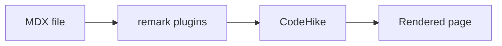
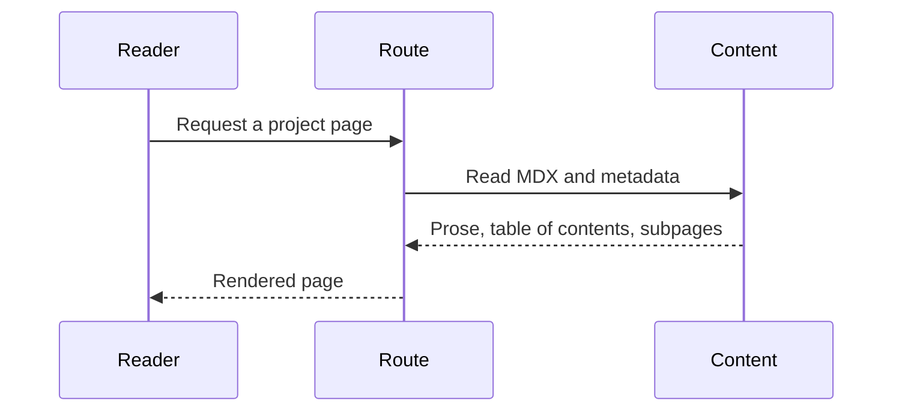

export const title = 'Current Website'
export const slug = 'current-website'
export const kind = 'Website'
export const status = 'active'
export const repo = 'https://github.com/sabinmarcu/omnirepo'
export const tags = ['project:kind:website', 'project:status:active', 'tool:next-js', 'tool:react', 'tool:mdx', 'tool:codehike', 'topics:typography']
export const createdAt = '02.09.2026'
export const modifiedAt = '07.09.2026'

This is the website you are reading. It is built as a Next.js and React application in this monorepo, with MDX files providing the published project, tool, and snippet content.

## Structure

The application keeps routes, layouts, components, models, and theme code together under `apps/website`. Content lives alongside the application in typed collections, so an article can provide both its prose and the metadata used for navigation, search, and project listings.

## Reference pages

Some details are easier to maintain as small reference pages than inside an overview. The typography page records the heading hierarchy used by the site, the annotations page collects the authoring blocks used by both humans and agents, and the tables and diagrams page covers the two markdown forms that are neither prose nor code.

# !!file Typography

## !slug typography

# Heading One

The first heading establishes the top level of the document hierarchy and gives the following headings a clear parent.

## Heading Two

The second heading divides the article into its primary ideas. It needs to create a visible pause without making the page feel like a stack of disconnected cards.

### Heading Three

The third heading groups related details inside a larger section. Its scale should preserve hierarchy while keeping the relationship to its accompanying text immediate.

#### Heading Four

The fourth heading identifies a focused topic or supporting argument. It is often the point where readers scan, compare, and decide which detail deserves attention.

##### Heading Five

The fifth heading is compact by design. It should remain distinct from body text while fitting naturally into dense technical or reference material.

###### Heading Six

The sixth heading completes the hierarchy. Even at its smallest, it must retain enough contrast to work as a label rather than looking like an accidental bold sentence.

# !!file Annotations

## !slug annotations

## !entrydepth 2
## !maxdepth 3

# Annotations

Annotations are the small authored markers that turn plain MDX into structured website content. They define project subpages, stable slugs, summaries, showcased files, and code presentation details without moving that information into route code.

This page collects the building blocks that are useful when writing by hand and when asking agents to produce content. Each section shows the source pattern first, then explains what the rendered page does with it.

## Block Framing & Defaults

Block-level presentation annotations control default chrome, line indicators, headers, and overlay controls without requiring a custom component in the MDX file.

### Language Label

Code blocks show their current language as a label by default. It does not switch or change the code. Use `!no-language` to hide it, or `!language` to enable it explicitly.

<CodeWithTabs>

```ts !!tabs Default
export const packageManagers = ['yarn', 'pnpm', 'npm'];
```

```ts !!tabs !no-language
// !noop language
// !language
export const packageManagers = ['yarn', 'pnpm', 'npm'];
```

```ts !!tabs !no-language
// !noop no-language
// !no-language
export const packageManagers = ['yarn', 'pnpm', 'npm'];
```

</CodeWithTabs>

### Line Numbers

Non-shell code displays line numbers by default. Shell blocks omit them so short commands stay compact, but `!line-numbers` opts an individual shell example back in. Use `!no-line-numbers` to opt out of the default on any language.

<CodeWithTabs>

```ts !!tabs Default
const managers = [
  'yarn',
  'pnpm',
  'npm',
];
```

```ts !!tabs !line-numbers
// !noop line-numbers
// !line-numbers
const managers = [
  'yarn',
  'pnpm',
  'npm',
];
```

```ts !!tabs !no-line-numbers
// !noop no-line-numbers
// !no-line-numbers
const managers = [
  'yarn',
  'pnpm',
  'npm',
];
```

```sh !!tabs shell script example
# !noop line-numbers
# !line-numbers
# !noop no-shell-prompt
# !no-shell-prompt
function website_build() {
  local project=${1:-website}

  if [[ $project == website ]]; then
    yarn install --immutable
    yarn moon run "$project:build"
  else
    print "Unknown project: $project" >&2
    return 1
  fi
}
```

</CodeWithTabs>

### Copy Button

Shell blocks show a copy button by default, while non-shell blocks keep copy buttons opt-in. Use `!copy` to enable copying, or `!no-copy` to hide it.

```ts
// !noop copy
// !copy
export const packageManagers = ['yarn', 'pnpm', 'npm'];
```

When `!copy` is present alongside the language label, both share the same overlay rail.

### Shell Prefix

The project runs through the repository's Yarn and Moon tasks. Shell blocks show the `$` prefix and a copy button by default. Use `!no-shell-prompt` or `!no-copy` when a shell block should not show either one, or use `!shell-prompt` and `!copy` to add them to another code language.

<CodeWithTabs>

```sh !!tabs Default
yarn moon run website:build
```

```sh !!tabs !no-shell-prompt
# !noop no-shell-prompt
# !no-shell-prompt
yarn moon run website:build
```

```sh !!tabs !no-copy
# !noop no-copy
# !no-copy
yarn moon run website:build
```

```sh !!tabs !no-copy !no-shell-prompt
# !noop no-copy
# !no-copy
# !noop no-shell-prompt
# !no-shell-prompt
yarn moon run website:build
```

</CodeWithTabs>

### File Names

Plain fence metadata is rendered as a file name above the code block.

````mdx package-manager.ts
```ts package-manager.ts
export const packageManagers = ['yarn', 'pnpm', 'npm'];
```
````

## Visual & Line Annotations

Annotations can draw attention to a specific part of an example or adjust line presentation without changing the code readers can copy.

### Marked Code

`!mark` highlights the next line. Add a range or regular expression to mark only part of a line, and add a color after the selector to override the theme accent.

```ts
function publish(version: string) {
  // !noop mark blue
  // !mark blue
  assertCleanWorkingTree();
  // !noop mark[/version/] gold
  // !mark[/version/] gold
  return createRelease(version);
}
```

### Diffs

`!diff +` and `!diff -` identify inserted and removed lines. Diff styling reuses the mark annotation so both features retain the same visual structure.

Use `!noop` before an annotation marker to show that marker as code instead of interpreting it. The `noop` prefix is omitted from the rendered line.

````ts
export function packageCommand(manager: string) {
  // !noop diff -
  // !diff -
  return `${manager} install`;
  // !noop diff +
  // !diff +
  return manager === 'npm' ? 'npm install' : `${manager} add`;
}
````

### Folded Details

`!fold` replaces matching inline content with an expandable ellipsis. The native disclosure keeps the full text in the server-rendered document and remains expandable without JavaScript.

```tsx
// !noop fold[/className="(.*?)"/gm]
// !fold[/className="(.*?)"/gm]
export function Status() {
  return <span className="status status--ready">Ready</span>;
}
```

### Word Wrapping

`!word-wrap` keeps long lines inside the available width and aligns wrapped text with the original indentation.

```ts
// !noop word-wrap
// !word-wrap
const command = createPackageManagerCommand({ manager: 'yarn', operation: 'exec', package: 'typescript', executable: 'tsc', arguments: ['--watch', '--preserveWatchOutput'] });
```

## Complex Components

Some authoring patterns need more than a single markdown element. These components keep the MDX source readable while letting the rendered page group related examples, controls, or comparisons into one block.

### Code Tabs

Related code blocks that describe one change across several files belong together rather than stacked one after another.

<CodeWithTabs>

````mdx !!tabs tabs.mdx
<CodeWithTabs>

```ts !!tabs component.tsx
export function Example() {
  return <p>Example</p>;
}
```

```ts !!tabs component.css.ts
export const exampleStyle = style({
  display: 'block',
});
```

</CodeWithTabs>
````

```ts !!tabs component.tsx
export function Example() {
  return <p>Example</p>;
}
```

```ts !!tabs component.css.ts
export const exampleStyle = style({
  display: 'block',
});
```

</CodeWithTabs>


### Package Manager Commands

The `!package` annotation describes a package-manager-neutral command and renders the matching Yarn, pnpm, and npm forms as tabs.

**Install packages**

```sh !package install typescript zod
```

````md
 <!-- !no-line-numbers -->
```sh !package install typescript zod
```
````

Each variant adds the same two packages to the current project and passes their names through unchanged. Only the command differs: Yarn and pnpm distinguish adding a dependency from installing the project, so they use `add`, while npm overloads `install`.

**Scaffold a project with a one-off package**

```sh !package exec create-vite my-app --template react-ts
```

````md
 <!-- !no-line-numbers -->
```sh !package exec create-vite my-app --template react-ts
```
````

Here the binary and the package share a name, so no package needs to be declared. The project name and template arguments are identical everywhere, and only the runner changes: `yarn dlx`, `pnpm dlx`, and `npx`.

**Run a binary from a named package**

```sh !package exec --package typescript tsc --watch
```

````md
 <!-- !no-line-numbers -->
```sh !package exec --package typescript tsc --watch
```
````

When the binary does not match the package that supplies it, the package has to be named explicitly. The runners differ as above, and so does the flag: Yarn spells it `-p`, while pnpm and npm both use `--package`.

# !!file Tables & Diagrams

## !slug tables-and-diagrams

# Tables and diagrams

Not every part of an article is prose or code. A comparison between three options wants a table, and a resolution order or a request path wants a diagram. Both are written as ordinary markdown, and neither is routed through the code pipeline.

## Tables

Tables use pipe syntax: a header row, a delimiter row, then one row per record. The outer pipes are optional, and the columns do not have to line up in the source.

````md
| Annotation | Applies to | Effect |
| --- | --- | --- |
| `!mark` | One line | Highlights the line |
| `!diff +` | One line | Marks the line as inserted |
| `!word-wrap` | The block | Wraps long lines in place |
````

| Annotation | Applies to | Effect |
| --- | --- | --- |
| `!mark` | One line | Highlights the line |
| `!diff +` | One line | Marks the line as inserted |
| `!word-wrap` | The block | Wraps long lines in place |

Inline markdown works inside cells, so a cell can carry code, emphasis, or a link. A cell cannot carry a block: no paragraphs, lists, or fenced code. A table that needs those is usually a set of headed sections instead.

### Column alignment

Colons in the delimiter row set alignment per column. `:---` aligns to the start, `:---:` centres, and `---:` aligns to the end. A column with no colons is start-aligned.

````md
| Package manager | Install | Exec |
| :--- | :---: | ---: |
| Yarn | `add` | `dlx` |
| pnpm | `add` | `dlx` |
| npm | `install` | `npx` |
````

| Package manager | Install | Exec |
| :--- | :---: | ---: |
| Yarn | `add` | `dlx` |
| pnpm | `add` | `dlx` |
| npm | `install` | `npx` |

### Width

A table wider than the article column scrolls sideways rather than crushing its cells, and header cells do not wrap. Short column headings and short cells therefore read better than a table that has to be scrolled to be understood.

## Diagrams

A fenced block tagged `mermaid` is rendered as a diagram. The body is Mermaid source, which covers flowcharts, sequence diagrams, state diagrams, class diagrams, and entity relationship diagrams among others.

````md

````


Diagrams are worth reaching for when the subject is a shape: an architecture, a dependency graph, a workflow, or a set of state transitions. A diagram that restates a two-item list is noise.

### How the site treats them

A `mermaid` fence is claimed before CodeHike sees it. Code annotations such as `!mark` and `!diff` therefore have no meaning inside one, and a diagram carries none of the code-block chrome: no language label, no line numbers, and no copy button.

Colours come from the site theme rather than from Mermaid's own palettes, so a diagram takes on the theme family of the section it sits in and follows light and dark along with the rest of the page. Node and edge styles written into the diagram itself still win, which is the point of writing them.

The drawing happens in the browser, and the library is fetched only for pages that contain a diagram. If the source does not parse, the page prints it as text rather than failing.

### A second example



# !summary

The current implementation of this personal website, including its MDX-backed content and typography reference.