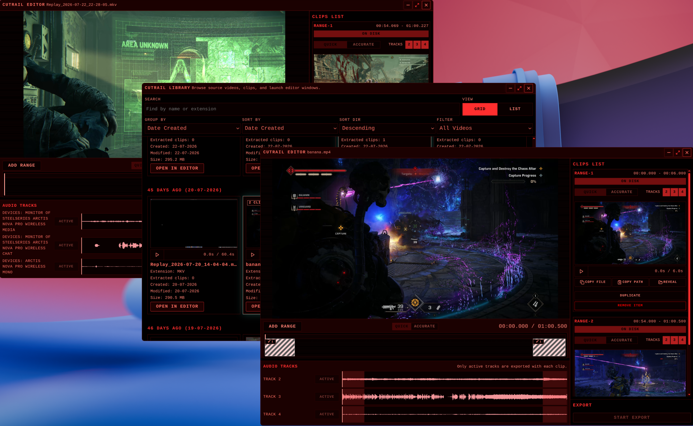
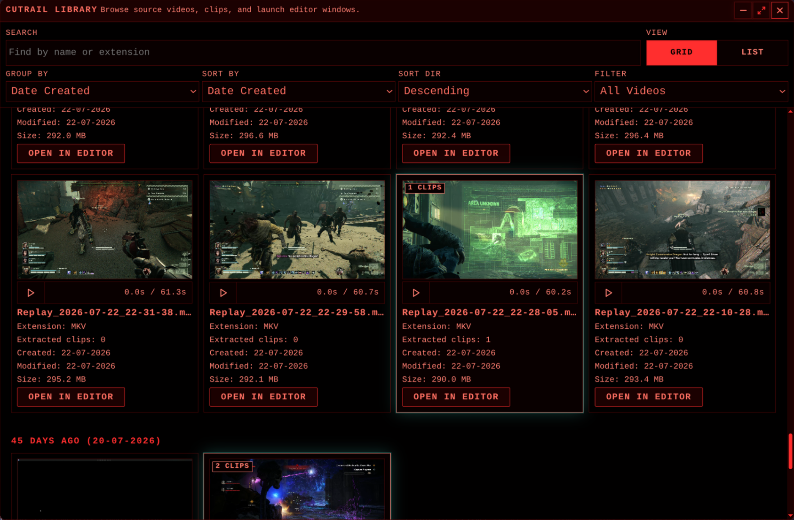
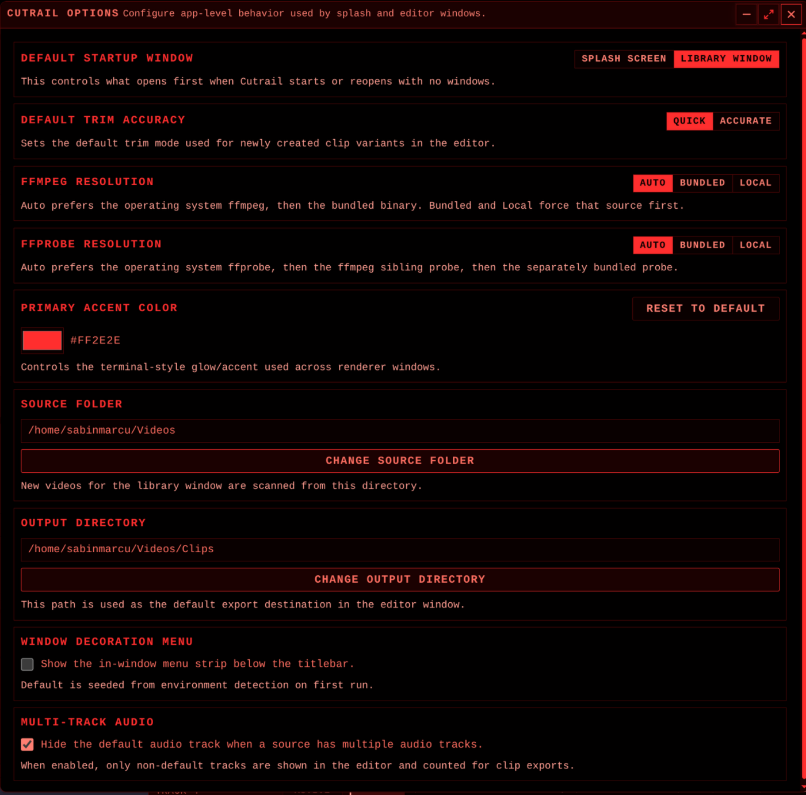
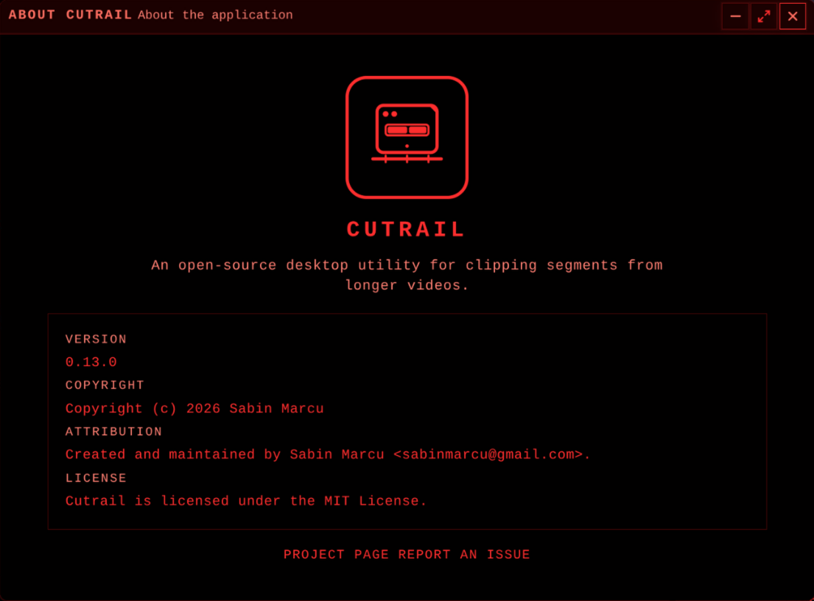
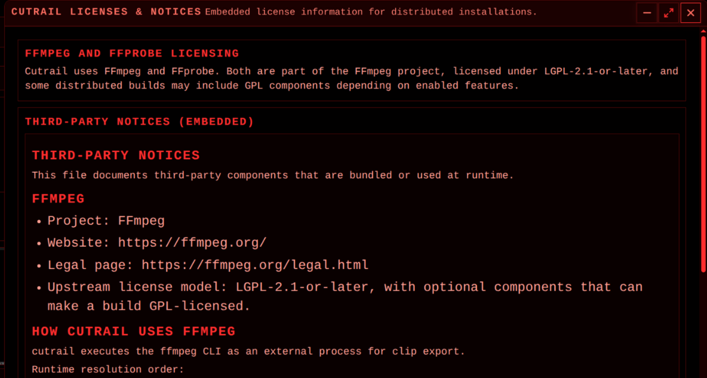

export const title = 'Cutrail'
export const slug = 'cutrail'
export const kind = 'Desktop application'
export const status = 'active'
export const repo = 'https://github.com/sabinmarcu/cutrail'
export const tags = ['project:kind:desktop-application', 'project:status:active', 'lang:typescript', 'tool:electron', 'tool:react', 'tool:vite', 'tool:ffmpeg']
export const createdAt = '04.07.2026'
export const modifiedAt = '05.09.2026'

Cutrail exists to extract clips from a longer video quickly, without turning a short task into a video-editing project. Open a source, mark the parts worth keeping, and export them as separate files. It is a desktop utility for clipping, not a general-purpose editor.

The application pairs an editor with a library. The library scans a chosen source directory, groups source videos and Cutrail exports, and opens a selected source in its own editor window. Each editor stays independent, so several videos can be prepared at the same time.

Cutrail invokes FFmpeg as an external process for export and uses FFprobe to inspect the source. The app does not implement its own codec or encoding pipeline. Each range can use fast or accurate trimming, depending on whether speed or precise boundaries matter more.

Sources with multiple audio tracks can keep the useful tracks together. The editor exposes the tracks individually, and FFmpeg mixes every active track into the clip's output audio stream. Muting every track produces a silent export.

# !!file Library and utility windows

## !slug library

# Library and utility windows

The Library is the starting point for browsing source videos and past exports. It supports search by name or extension, grid and list views, filtering, grouping, and sorting. Each source card shows its file details and how many clips Cutrail has identified. Selecting a source opens it in an editor window.

An export records metadata for its source fingerprint, range, and variant. The library uses that metadata first to associate clips with a source. Older exports without it can still be matched from their filenames, while files Cutrail cannot classify are left as foreign rather than treated as its own output.

## Options

The Options window controls application-wide behavior shared by the splash screen and editor windows. It chooses the startup window, default trim accuracy, source and output directories, accent color, and whether the in-window menu strip is displayed.

It also controls how FFmpeg and FFprobe are resolved: automatically, from the bundled binaries, or from a local installation. Multi-track sources can hide the default track, keeping the editor focused on the alternate tracks that will be included in an export.

## Other windows

About documents the application identity, version, maintainer, project link, and MIT license. Licenses & Notices embeds the third-party notices delivered with the application, including the FFmpeg and FFprobe licensing information.

# !!file Editor

## !slug editor

# Editor flows and concepts

Each source video opens in an independent editor window. The main video view is paired with a range timeline, an audio-track panel, and a clip list. The editor concentrates on three things: choosing ranges, deciding which audio to keep, and exporting the result.

## Ranges

A range describes a start and end time in the source. Add ranges to capture more than one moment from the same video. The timeline keeps the range boundaries visible against the source duration while the player provides the visual reference for adjusting them.

Every range chooses a trim mode. Quick trimming favours speed; accurate trimming favours precise start and end boundaries. A range can be duplicated, removed, or exported independently. The clip list retains each range and its selected mode, audio-track selection, and export state.

## Audio tracks

The editor reads the audio streams in the source and shows each track with a waveform. Tracks can be active or muted per range. At export time, FFmpeg mixes the active tracks together into one audio stream. This makes it possible to retain, for example, several recorded channels in a single clip instead of choosing only one.

When no tracks are active, the clip is exported without audio. The option to hide the source's default audio track applies when several tracks are available and the remaining tracks are the ones that matter.

## Export

An export writes each configured range to the selected output directory. Cutrail passes the range, trim mode, and active-audio selection to FFmpeg, then stores metadata with the output so it can be recognised later in the Library. The output is a clip file, not an editable Cutrail project.

Cutrail associates `.mp4`, `.mkv`, `.webm`, `.mov`, and `.avi` files with the desktop application. Opening one of those supported files from the operating system creates an editor window directly.

# !summary

A desktop application for quickly extracting clips from longer videos. Cutrail uses FFmpeg for export, groups source videos and clips in a library, and can mix active audio tracks into each clip.