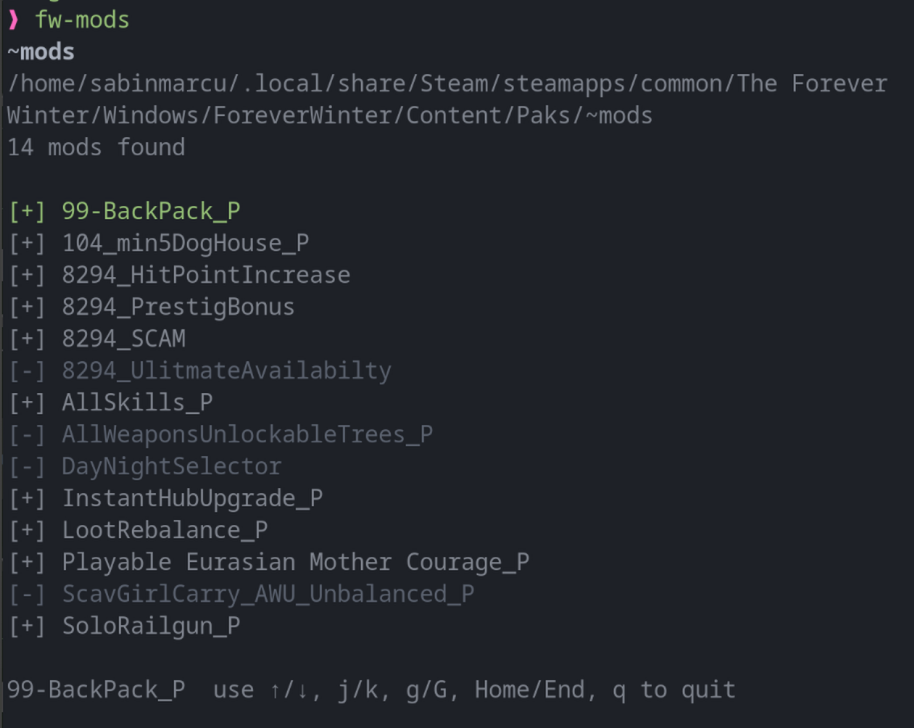
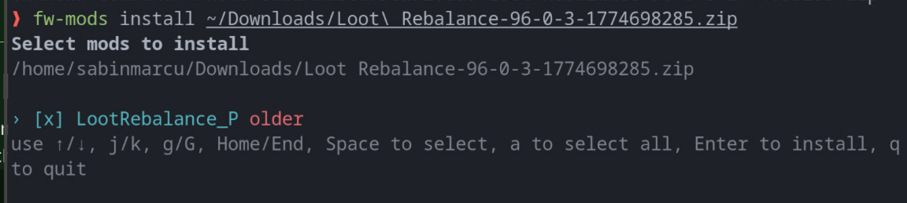
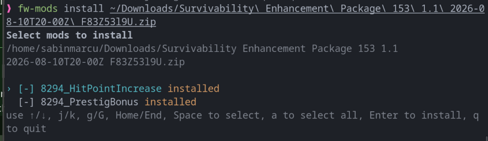

export const title = 'Forever Winter Mods'
export const slug = 'foreverwinter-mods'
export const kind = 'CLI'
export const status = 'active'
export const repo = 'https://github.com/sabinmarcu/foreverwinter-mods-cli'
export const tags = ['project:kind:cli', 'project:status:active', 'lang:typescript', 'tool:node-js', 'tool:react', 'tool:ink', 'tool:7z']
export const createdAt = '03.09.2026'
export const modifiedAt = '05.09.2026'

Un CLI interactiv pentru instalarea, activarea și dezactivarea tripletelor de moduri pentru The Forever Winter.

Modurile pentru The Forever Winter nu sunt fișiere individuale. Un mod jucabil este un triplet potrivit de fișiere `.pak`, `.ucas` și `.utoc`. Copierea manuală a fișierelor individuale poate lăsa o instalare parțială pe care jocul nu o poate folosi. Forever Winter Mods face acest contract explicit: descoperă o instalare a jocului, citește arhivele compatibile și operează doar asupra tripletelor complete.

Proiectul este publicat ca [`@sabinmarcu/foreverwinter`](https://www.npmjs.com/package/@sabinmarcu/foreverwinter).

## Cum funcționează

Rulează `fw-mods` fără nicio comandă pentru a deschide o listă în terminal cu tripletele de moduri complete din directorul de moduri selectat. Fiecare intrare poate fi activată sau dezactivată printr-o singură operație, astfel încât cele trei fișiere necesare rămân mereu în aceeași stare.

Folosește `fw-mods install <archive>` pentru a inspecta o arhivă `.zip`, `.7z` sau `.7zip`. Un singur triplet nou se instalează imediat. Arhivele care conțin mai multe triplete, sau un mod deja prezent, deschid mai întâi un selector. Înainte de instalare, CLI-ul compară marcajele temporale ale arhivei cu tripletul instalat și etichetează fiecare intrare drept `new`, `update`, `older` sau `installed`.

CLI-ul nu extrage o arhivă cu conținut neașteptat. Fișierele de documentație sunt permise, dar alte tipuri de fișiere îl fac să se oprească și să ceară jucătorului să citească instrucțiunile de instalare ale arhivei. De asemenea, nu șterge modurile instalate. Aceasta este o limită deliberată: unealta gestionează triplete complete și refuză să ghicească cum ar trebui tratată o arhivă necunoscută sau un fișier fără legătură.

## Terminologie

**Triplet de mod**

Un set de trei fișiere cu același nume de bază: `.pak`, `.ucas` și `.utoc`. De exemplu, `Example_P.pak`, `Example_P.ucas` și `Example_P.utoc` formează un triplet. CLI-ul listează, comută sau instalează un mod doar când toate cele trei fișiere potrivite sunt prezente.

**Activat și dezactivat**

Un triplet activat își păstrează numele de fișier normale. Un triplet dezactivat adaugă `.disabled` după fiecare extensie, precum `Example_P.pak.disabled`. Conținutul rămâne în același director; doar numele se schimbă.

**Director de moduri**

Directorul aflat sub directorul `Paks` al jocului, care conține tripletele de moduri. Instalarea jocului folosește în mod normal `Windows/ForeverWinter/Content/Paks` sub directorul său Steam. CLI-ul acceptă orice director existent atunci când este furnizat `--path`.

**Arhivă**

Un fișier `.zip`, `.7z` sau `.7zip` care conține unul sau mai multe triplete de moduri. Folderele din arhivă sunt permise, dar fiecare mod este identificat prin propriul triplet complet, cu același nume.

## Detectarea automată a directorului de moduri

La pornire, CLI-ul verifică mai întâi un `--path` furnizat. Acesta rezolvă calea respectivă către un director real; o cale lipsă sau un fișier sunt respinse. Fără `--path`, caută în locațiile obișnuite de instalare Steam pe Windows și Linux.

Pe Windows, verifică `C:\Program Files (x86)\Steam` și `C:\Program Files\Steam`. Pe Linux, verifică `~/.steam/steam`, `~/.local/share/Steam` și locația Steam pentru Flatpak la `~/.var/app/com.valvesoftware.Steam/.local/share/Steam`. Pentru fiecare bibliotecă Steam existentă, caută atât `The Forever Winter`, cât și `Forever Winter` sub `steamapps/common`, apoi verifică directorul `Windows/ForeverWinter/Content/Paks` al jocului.

În interiorul unui director `Paks` existent, fiecare subdirector al cărui nume conține `mods` este un candidat. Candidații sunt ordonați după nume: `~mods` este preferat, apoi `mods`, apoi numele care se termină în `mods`, iar în final orice alt director potrivit, în ordine alfabetică. Primul candidat este folosit.

Aceasta este în mod intenționat o euristică bazată pe numele directorului, nu un analizor al bibliotecii Steam. Nu citește configurația Steam și nu scanează discuri arbitrare. Dacă nu poate găsi un director potrivit, cere calea completă. De asemenea, poți ocoli explicit detectarea:

```sh
yarn dlx @sabinmarcu/foreverwinter --path "/path/to/~mods"
```

# !!file Prerequisites

## !slug prerequisites

# Cerințe preliminare și instalare

Forever Winter Mods necesită Node.js 20 sau mai nou și o instalare locală a The Forever Winter. CLI-ul rulează într-un terminal și necesită acces de citire și scriere la directorul de moduri țintă.

## Rulare fără instalare

Pachetul poate fi descărcat și rulat pentru o singură comandă cu Yarn:

```sh
yarn dlx @sabinmarcu/foreverwinter
```

Aceasta deschide managerul de moduri după ce CLI-ul găsește un director de moduri sau după ce furnizezi unul. Pentru a folosi un director pe care detectarea automată nu îl poate găsi, transmite calea completă:

```sh
yarn dlx @sabinmarcu/foreverwinter --path "/path/to/~mods"
```

Calea furnizată trebuie să existe deja și să fie un director. CLI-ul nu creează un director de moduri lipsă.

## Instalarea comenzii local

Pentru a face `fw-mods` disponibil ca o comandă de proiect, adaugă pachetul la un proiect Node.js:

```sh
yarn add --dev @sabinmarcu/foreverwinter
```

Apoi rulează-l prin Yarn:

```sh
yarn fw-mods
```

Folosește `--path` ori de câte ori jocul este instalat în afara locațiilor căutate de detectarea automată.

# !!file Managing mods

## !slug manager

# Folosirea managerului de moduri

Pornește managerul fără nicio comandă:

```sh
yarn dlx @sabinmarcu/foreverwinter
```

Lista conține doar triplete complete. O intrare cu `[+]` este activată; o intrare cu `[-]` este dezactivată. Fișierele care nu formează un set complet `.pak`, `.ucas` și `.utoc` nu apar, iar managerul nu le repară și nu le elimină.



## Activare și dezactivare

Deplasează-te cu săgețile Sus și Jos sau cu `j` și `k`. Apasă Space pe intrarea selectată pentru a o comuta.

Dezactivarea redenumește toate cele trei fișiere adăugând `.disabled`. Activarea elimină acest sufix de la toate cele trei fișiere. Datele modului rămân în directorul de moduri selectat, indiferent de stare, deci comutarea este reversibilă.

Folosește `g` sau Home pentru a selecta prima intrare, `G` sau End pentru a selecta ultima intrare, și `q` sau Ctrl+C pentru a ieși. Managerul necesită un terminal interactiv; se închide atunci când intrarea sau ieșirea standard nu este un TTY.

# !!file Installing and removing mods

## !slug installing-and-removing

# Instalarea și eliminarea modurilor

## Instalarea unei arhive

Transmite arhiva după comanda `install`. Opțiunea `--path` poate apărea înainte sau după `install`.

```sh
yarn dlx @sabinmarcu/foreverwinter install "/path/to/mod.zip"
```

```sh
yarn dlx @sabinmarcu/foreverwinter --path "/path/to/~mods" install "/path/to/mod.7z"
```

Arhiva trebuie să fie un fișier `.zip`, `.7z` sau `.7zip`. CLI-ul găsește triplete complete chiar și atunci când se află în foldere din arhivă. Un singur triplet nou se instalează imediat. În alte cazuri, arată un selector. Folosește săgețile sau `j` și `k` pentru a te deplasa, Space pentru a selecta un mod eligibil, `a` pentru a selecta sau deselecta toate modurile eligibile, Enter pentru a instala și `q` pentru a ieși.



Un mod existent este etichetat `installed` atunci când fiecare marcaj temporal din arhivă corespunde fișierului instalat corespunzător. Rămâne vizibil, dar nu poate fi selectat. Un mod instalat care nu se potrivește este etichetat `update` atunci când cel puțin un fișier din arhivă este mai nou; altfel este etichetat `older`.



În timpul unei instalări, fiecare fișier de destinație este extras mai întâi într-un fișier temporar. Tripletele complete existente sunt salvate ca backup, iar instalarea este anulată dacă o scriere ulterioară eșuează. Marcajele temporale ale fișierelor din arhivă sunt păstrate pe fișierele instalate.

## Arhive pe care CLI-ul nu le va instala

Fișierele de documentație precum `README`, `INSTALL`, `LICENSE`, `.txt`, `.md`, `.nfo` și `.rtf` sunt permise alături de triplete. Orice alt tip de fișier oprește instalarea, inclusiv tripletele incomplete și numele de mod duplicate. CLI-ul listează fișierele din arhivă și le lasă neatinse, astfel încât să poți urma manual instrucțiunile autorului.

## Eliminarea unui mod

Nu există o comandă `remove` sau `uninstall`. CLI-ul nu șterge fișiere de mod.

Pentru a elimina un mod, închide jocul și șterge tripletul său complet din directorul de moduri: fișierele potrivite `.pak`, `.ucas` și `.utoc`. Pentru un mod dezactivat, șterge fișierele corespunzătoare `.pak.disabled`, `.ucas.disabled` și `.utoc.disabled`. Nu șterge doar un membru al unui triplet; managerul ignoră seturile incomplete și nu poate restaura fișierele lipsă.

# !!file Command API

## !slug api

# API-ul de comandă

Pachetul publicat oferă executabilul `fw-mods`. Cu Yarn, poate fi rulat fără o instalare globală prin `yarn dlx @sabinmarcu/foreverwinter`.

## `fw-mods`

```sh
fw-mods [--path <mods-directory>]
```

Deschide managerul interactiv de moduri. Fără `--path`, încearcă detectarea automată și cere un director dacă nu este găsit niciun candidat.

## `fw-mods install`

```sh
fw-mods install [--path <mods-directory>] <archive>
```

Inspectează și instalează triplete complete din `<archive>`. Argumentul arhivă este obligatoriu. `--path` poate fi plasat înainte sau după `install`.

## `--path <mods-directory>`

Selectează un director existent în locul detectării automate. Poate fi furnizat o singură dată pentru oricare dintre comenzi. O valoare lipsă, un al doilea `--path`, sau o cale care nu este un director reprezintă o eroare.

## Erori și intrări nesuportate

Doar `install` este acceptată ca o comandă explicită. O comandă sau opțiune nerecunoscută produce o eroare. Trimiterea `install` fără exact o arhivă produce acest mesaj de utilizare:

```text
Usage: fw-mods install [--path <mods-directory>] <archive>
```

Calea arhivei trebuie să existe, să se refere la un fișier și să folosească o extensie suportată. O cale de moduri furnizată trebuie să se rezolve către un director. Conținutul de arhivă care nu îndeplinește regulile privind tripletele complete nu este instalat.

# !summary

Un CLI interactiv pentru descoperirea, instalarea, activarea și dezactivarea tripletelor complete de moduri pentru The Forever Winter. Se oprește la conținutul de arhivă necunoscut și lasă ștergerea modurilor în seama jucătorului.
