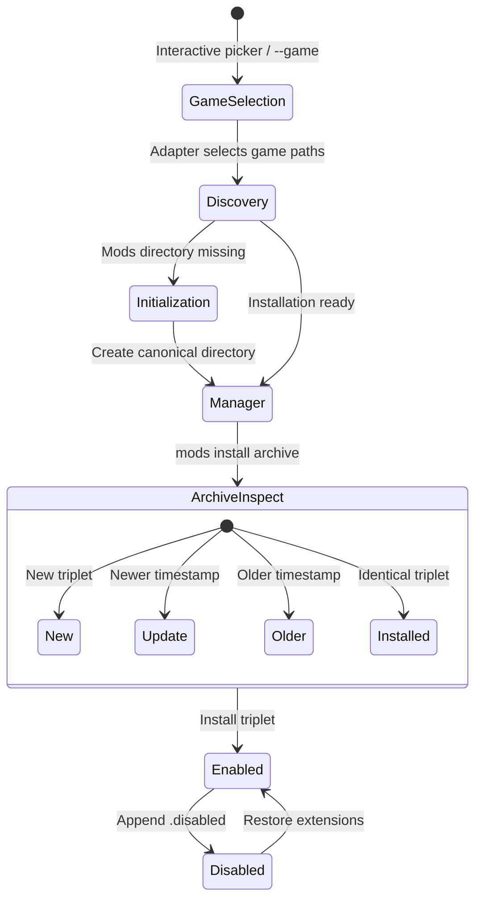
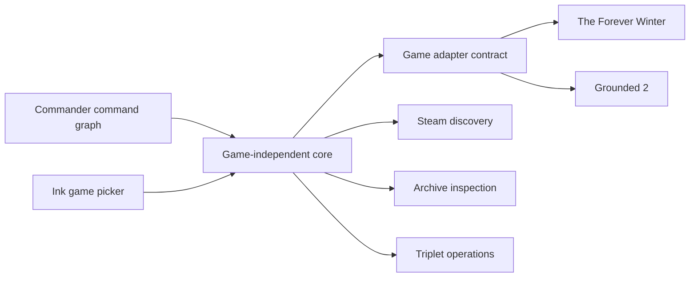

export const title = 'Mods'
export const slug = 'mods-manager'
export const kind = 'CLI'
export const status = 'active'
export const repo = 'https://github.com/sabinmarcu/mods-manager'
export const tags = ['project:kind:cli', 'project:status:active', 'lang:typescript', 'tool:node-js', 'tool:react', 'tool:ink', 'tool:7z', 'topics:gaming']
export const createdAt = '13.09.2026'
export const modifiedAt = '13.09.2026'

Mods is an interactive CLI for installing, enabling, and disabling Unreal Engine mod triplets across supported games.

It began as Forever Winter Mods, where game discovery, paths, and mod operations all belonged to one game-specific utility. Mods retains that behavior and moves the game-specific decisions behind adapters. Archive inspection, transactional installation, triplet state changes, and the terminal interface are now shared by every supported game.

The current release supports The Forever Winter and Grounded 2. The project is published as [`@sabinmarcu/mods`](https://www.npmjs.com/package/@sabinmarcu/mods).

## How it works

Run `mods` without a command to open an interactive game picker. It lists the supported games and reports whether each one is ready, needs its mods directory initialized, or was not detected. After selecting a ready installation, the CLI displays its complete mod triplets.

Each entry can be enabled or disabled as one operation, so its required `.pak`, `.ucas`, and `.utoc` files remain in the same state. Use `mods install <archive>` with a selected game to inspect a `.zip`, `.7z`, or `.7zip` archive. A single new triplet installs immediately. Archives with multiple triplets or an existing mod open a selector first.



The CLI does not extract an archive with unexpected payloads and does not delete installed mods. Documentation files are permitted, but other file types cause it to stop and leave the archive for manual review. The tool manages complete triplets and refuses to guess how an unfamiliar archive or unrelated file should be handled.

## What changed from Forever Winter Mods

The original CLI searched for one game and accepted a direct mods-directory override. Mods introduces an explicit game layer:

- A game picker provides the default interactive entry point.
- Stable game IDs support scripts and direct selection through `--game`.
- `mods games` reports every registered game and its detected installations.
- `--game-root` accepts an installation root; the selected adapter resolves the final mods directory.
- `mods init` creates a missing canonical `~mods` directory when its parent exists.
- Shell completion is generated from the same Commander command graph used for parsing.

These additions change how a target directory is selected, not how mod files are interpreted. The complete-triplet contract and archive safety rules remain shared.

## Game adapters

Each adapter owns four facts: a stable ID, a display name, game-root discovery, and the mapping from a game root to its canonical mods directory. The core owns Steam library discovery, installation-state inspection, archive handling, mod operations, and the Ink interface.



Adapters are registered at build time. The CLI does not load arbitrary adapter packages, so adding another game requires a source change and a new release.

## Supported games

| Game | ID | Mods directory relative to game root |
| --- | --- | --- |
| The Forever Winter | `foreverwinter` | `Windows/ForeverWinter/Content/Paks/~mods` |
| Grounded 2 | `grounded2` | `Augusta/Content/Paks/~mods` |

Both adapters allow the final `~mods` directory to be created when its parent game directory exists.

## Terminology

**Mod triplet**

A set of three files with the same basename: `.pak`, `.ucas`, and `.utoc`. For example, `Example_P.pak`, `Example_P.ucas`, and `Example_P.utoc` make one triplet. The CLI only lists, toggles, or installs a mod when all three matching files are present.

**Enabled and disabled**

An enabled triplet keeps its normal filenames. A disabled triplet appends `.disabled` after each extension, such as `Example_P.pak.disabled`. The payload stays in the same directory; only the names change.

**Game root**

The installation directory for a supported game. `--game-root` accepts this directory rather than a `Paks` or `~mods` directory. The selected adapter derives the canonical mods path beneath it.

**Archive**

A `.zip`, `.7z`, or `.7zip` file containing one or more mod triplets. Archive folders are allowed, but each mod is identified by its own complete, same-named triplet.

## Steam discovery and installation state

The CLI searches Steam libraries on Windows and Linux, including configured secondary libraries. Each adapter supplies the directory names that identify its game. Every detected installation is then classified as `ready`, `needs-initialization`, or `invalid`.

A ready installation already has its canonical mods directory. An installation needs initialization when the directory is absent but its parent exists. An invalid installation records why the expected location cannot be used. If discovery cannot find a usable installation during an interactive session, the CLI prompts for a game root.

This is a game-root workflow rather than an arbitrary mods-directory override. Supplying `--game-root` bypasses automatic discovery, but the adapter still derives and validates the final directory.

# !!file Prerequisites

## !slug prerequisites

# Prerequisites and installation

Mods requires Node.js 20 or newer and a local installation of a supported game. The CLI runs in a terminal and needs read and write access to the selected game's mods directory.

Install Node.js before running the package. The published command can then be downloaded and executed without a permanent installation:

```sh !package exec --package @sabinmarcu/mods mods
```

This opens the game picker. To select a game directly, pass its stable ID:

```sh !package exec --package @sabinmarcu/mods mods --game foreverwinter
```

If Steam discovery cannot find the installation, supply the game root:

```sh !package exec --package @sabinmarcu/mods mods --game grounded2 --game-root "/path/to/steamapps/common/Grounded2"
```

The supplied path must already exist and must be a directory. It identifies the game installation, not the final mods directory.

# !!file Managing mods

## !slug manager

# Using the mod manager

Start the manager without a command:

```sh !package exec --package @sabinmarcu/mods mods
```

Select a game from the picker, or bypass it with `--game`:

```sh !package exec --package @sabinmarcu/mods mods --game grounded2
```

The manager lists only complete triplets for the selected installation. An entry with `[+]` is enabled; an entry with `[-]` is disabled. Files that do not form a complete `.pak`, `.ucas`, and `.utoc` set do not appear, and the manager does not repair or remove them.

## Enable and disable

Move with the Up and Down arrow keys or `j` and `k`. Press Space on the selected entry to toggle it.

Disabling renames all three files by appending `.disabled`. Enabling removes that suffix from all three files. The mod data remains in the selected mods directory in either state, so toggling is reversible.

Use `g` or Home to select the first entry, `G` or End to select the last entry, and `q` or Ctrl+C to quit. The manager requires an interactive terminal; a non-interactive invocation must select a game explicitly and exits rather than presenting a list.

## Initialize a mods directory

The game picker can initialize a missing canonical mods directory interactively. For scripts or direct use, select a game and run `init`:

```sh !package exec --package @sabinmarcu/mods mods --game grounded2 init
```

Initialization creates only the final directory expected by the adapter, and only when its parent exists. If the game was not detected, combine the command with `--game-root`.

# !!file Installing and removing mods

## !slug installing-and-removing

# Installing and removing mods

## Install an archive

Select the target game and pass the archive after the `install` command:

```sh !package exec --package @sabinmarcu/mods mods --game grounded2 install "/path/to/mod.zip"
```

Use `--game-root` when automatic discovery cannot locate the game:

```sh !package exec --package @sabinmarcu/mods mods --game grounded2 --game-root "/path/to/Grounded2" install "/path/to/mod.7z"
```

The archive must be a `.zip`, `.7z`, or `.7zip` file. The CLI finds complete triplets even when they are inside archive folders. A single new triplet installs immediately. In other cases, it shows a selector. Use arrow keys or `j` and `k` to move, Space to select an eligible mod, `a` to select or clear all eligible mods, Enter to install, and `q` to quit.

An existing mod is labelled `installed` when every archive timestamp matches the corresponding installed file. It remains visible but cannot be selected. A nonmatching installed mod is labelled `update` when at least one archive file is newer; otherwise it is labelled `older`.

During installation, each destination file is first extracted to a temporary file. Existing complete triplets are backed up, and the installation is rolled back if a later write fails. Archive timestamps are preserved on the installed files.

## Archives the CLI will not install

Documentation files such as `README`, `INSTALL`, `LICENSE`, `.txt`, `.md`, `.nfo`, and `.rtf` are allowed alongside triplets. Any other file type stops installation, including incomplete triplets and duplicate mod names. The CLI lists the archive files and leaves them untouched so the mod author's instructions can be followed manually.

## Remove a mod

There is no `remove` or `uninstall` command. The CLI does not delete mod files.

To remove a mod, close the game and delete its complete triplet from the selected mods directory: the matching `.pak`, `.ucas`, and `.utoc` files. For a disabled mod, delete the corresponding `.pak.disabled`, `.ucas.disabled`, and `.utoc.disabled` files. Do not delete only one member of a triplet; the manager ignores incomplete sets and cannot restore missing files.

# !!file Command API

## !slug api

# Command API

The published package provides the `mods` executable. Package-manager execution can run it without a global installation.

## `mods`

```text
mods [--game <id>] [--game-root <directory>]
```

Opens the interactive game picker or the manager for an explicitly selected game. `--game` is required in a non-interactive environment.

## `mods games`

```text
mods games
```

Lists every registered game, its stable ID, detected state, and installation paths.

## `mods init`

```text
mods --game <id> [--game-root <directory>] init
```

Creates the canonical mods directory when the adapter permits initialization and its parent directory exists. The command requires `--game`.

## `mods install`

```text
mods --game <id> [--game-root <directory>] install <archive>
```

Inspects and installs complete triplets from `<archive>`. Interactive use can omit `--game` and select the target through the picker; non-interactive use requires it.

## Global options

`--game <id>` selects a registered adapter. `--game-root <directory>` overrides Steam discovery and requires `--game`; it accepts the installation root, not the final mods directory.

## Shell completion

The CLI provides a `completion` command for Bash, Zsh, Fish, and PowerShell. Generated completion files are also bundled in the package. Both forms derive commands, options, paths, and registered game IDs from the Commander command graph.

## Errors and unsupported input

An unknown game ID, command, or option is an error. A missing game root, archive path, or unsupported archive extension is also rejected. Non-interactive list and install operations require `--game`, while `init` always requires it. If a selected installation is not ready, the CLI requires initialization before continuing non-interactively.

# !summary

An interactive CLI for discovering supported Steam games and managing complete Unreal Engine mod triplets. It carries the archive and state-management behavior of Forever Winter Mods into an adapter-based platform that currently supports The Forever Winter and Grounded 2.