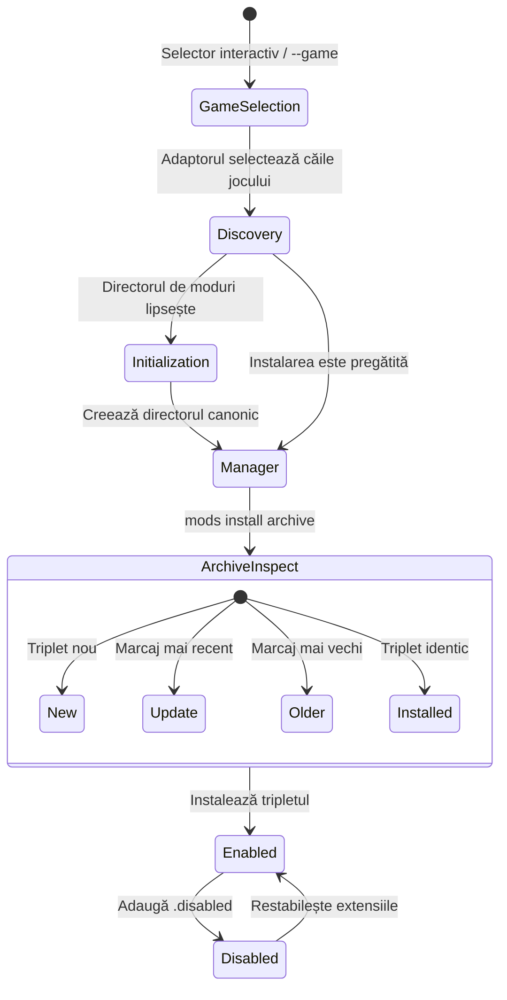
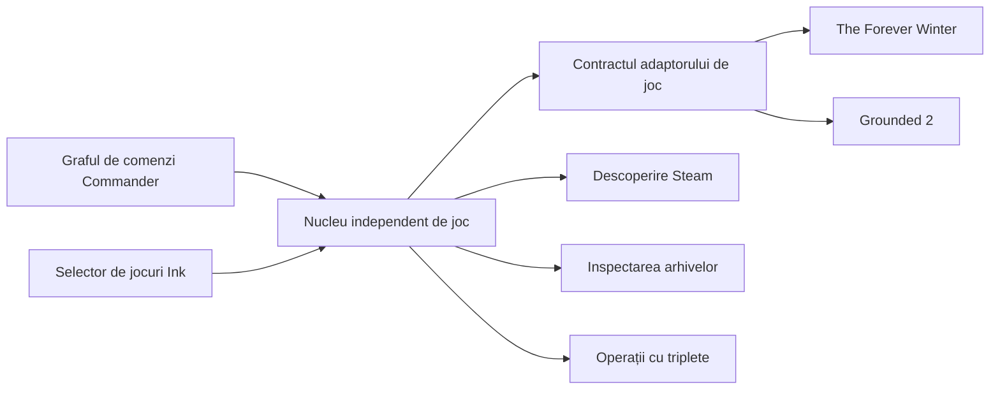

export const sourceHash = '5d02b940cc44f7323ac1cdefcd9f9d9f3b6ebfe5742217e42fd22d53e3762347'


export const title = 'Mods Manager'
export const slug = 'mods-manager'
export const kind = 'CLI'
export const status = 'active'
export const repo = 'https://github.com/sabinmarcu/mods-manager'
export const tags = ['project:kind:cli', 'project:status:active', 'lang:typescript', 'tool:node-js', 'tool:react', 'tool:ink', 'tool:7z', 'topics:gaming']
export const createdAt = '13.09.2026'
export const modifiedAt = '13.09.2026'

Mods este un CLI interactiv pentru instalarea, activarea și dezactivarea tripletelor de moduri Unreal Engine în jocurile suportate.

A început ca Forever Winter Mods, unde descoperirea jocului, căile și operațiile asupra modurilor aparțineau unui singur utilitar specific jocului. Mods păstrează acel comportament și mută deciziile specifice jocurilor în spatele adaptoarelor. Inspectarea arhivelor, instalarea tranzacțională, schimbările stării tripletelor și interfața din terminal sunt acum comune tuturor jocurilor suportate.

Versiunea curentă suportă The Forever Winter și Grounded 2. Proiectul este publicat ca [`@sabinmarcu/mods`](https://www.npmjs.com/package/@sabinmarcu/mods).

## Cum funcționează

Rulează `mods` fără o comandă pentru a deschide un selector interactiv de jocuri. Acesta listează jocurile suportate și raportează dacă fiecare este pregătit, necesită inițializarea directorului de moduri sau nu a fost detectat. După selectarea unei instalări pregătite, CLI-ul afișează tripletele sale complete de moduri.

Fiecare intrare poate fi activată sau dezactivată printr-o singură operație, astfel încât fișierele necesare `.pak`, `.ucas` și `.utoc` rămân în aceeași stare. Folosește `mods install <archive>` cu un joc selectat pentru a inspecta o arhivă `.zip`, `.7z` sau `.7zip`. Un singur triplet nou se instalează imediat. Arhivele cu mai multe triplete sau cu un mod existent deschid mai întâi un selector.



CLI-ul nu extrage o arhivă cu conținut neașteptat și nu șterge modurile instalate. Fișierele de documentație sunt permise, dar alte tipuri de fișiere îl fac să se oprească și să lase arhiva pentru verificare manuală. Unealta gestionează triplete complete și refuză să ghicească modul de tratare a unei arhive necunoscute sau a unui fișier fără legătură.

## Ce s-a schimbat față de Forever Winter Mods

CLI-ul original căuta un singur joc și accepta suprascrierea directă a directorului de moduri. Mods introduce un strat explicit pentru jocuri:

- Un selector de jocuri oferă punctul de intrare interactiv implicit.
- ID-urile stabile ale jocurilor permit scripturi și selectarea directă prin `--game`.
- `mods games` raportează fiecare joc înregistrat și instalările sale detectate.
- `--game-root` acceptă rădăcina unei instalări; adaptorul selectat rezolvă directorul final de moduri.
- `mods init` creează un director canonic `~mods` lipsă atunci când părintele său există.
- Completarea pentru shell este generată din același graf de comenzi Commander folosit pentru interpretare.

Aceste adăugiri schimbă modul de selectare a directorului țintă, nu modul de interpretare a fișierelor de mod. Contractul tripletului complet și regulile de siguranță pentru arhive rămân comune.

## Adaptoare de joc

Fiecare adaptor deține patru informații: un ID stabil, un nume afișat, descoperirea rădăcinilor jocului și maparea de la rădăcina unui joc la directorul său canonic de moduri. Nucleul deține descoperirea bibliotecilor Steam, inspectarea stării instalării, gestionarea arhivelor, operațiile asupra modurilor și interfața Ink.



Adaptoarele sunt înregistrate la compilare. CLI-ul nu încarcă pachete de adaptoare arbitrare, așadar adăugarea altui joc necesită o schimbare în sursă și o versiune nouă.

## Jocuri suportate

| Joc | ID | Director de moduri relativ la rădăcina jocului |
| --- | --- | --- |
| The Forever Winter | `foreverwinter` | `Windows/ForeverWinter/Content/Paks/~mods` |
| Grounded 2 | `grounded2` | `Augusta/Content/Paks/~mods` |

Ambele adaptoare permit crearea directorului final `~mods` atunci când directorul său părinte există.

## Terminologie

**Triplet de mod**

Un set de trei fișiere cu același nume de bază: `.pak`, `.ucas` și `.utoc`. De exemplu, `Example_P.pak`, `Example_P.ucas` și `Example_P.utoc` formează un triplet. CLI-ul listează, comută sau instalează un mod doar când toate cele trei fișiere potrivite sunt prezente.

**Activat și dezactivat**

Un triplet activat își păstrează numele de fișier normale. Un triplet dezactivat adaugă `.disabled` după fiecare extensie, precum `Example_P.pak.disabled`. Conținutul rămâne în același director; doar numele se schimbă.

**Rădăcina jocului**

Directorul de instalare al unui joc suportat. `--game-root` acceptă acest director, nu un director `Paks` sau `~mods`. Adaptorul selectat derivă calea canonică a modurilor de sub acesta.

**Arhivă**

Un fișier `.zip`, `.7z` sau `.7zip` care conține unul sau mai multe triplete de moduri. Directoarele din arhivă sunt permise, dar fiecare mod este identificat prin propriul triplet complet, cu același nume.

## Descoperirea Steam și starea instalării

CLI-ul caută biblioteci Steam pe Windows și Linux, inclusiv biblioteci secundare configurate. Fiecare adaptor furnizează numele directoarelor care îi identifică jocul. Fiecare instalare detectată este apoi clasificată drept `ready`, `needs-initialization` sau `invalid`.

O instalare pregătită are deja directorul canonic de moduri. O instalare necesită inițializare atunci când directorul lipsește, dar părintele său există. O instalare invalidă înregistrează motivul pentru care locația așteptată nu poate fi folosită. Dacă descoperirea nu găsește o instalare utilizabilă într-o sesiune interactivă, CLI-ul cere rădăcina jocului.

Acesta este un flux bazat pe rădăcina jocului, nu o suprascriere arbitrară a directorului de moduri. Furnizarea opțiunii `--game-root` ocolește descoperirea automată, dar adaptorul derivă și validează în continuare directorul final.

# !!file Prerequisites

## !slug prerequisites

# Cerințe preliminare și instalare

Mods necesită Node.js 20 sau mai nou și o instalare locală a unui joc suportat. CLI-ul rulează într-un terminal și necesită acces de citire și scriere la directorul de moduri al jocului selectat.

Instalează Node.js înainte de a rula pachetul. Comanda publicată poate fi apoi descărcată și executată fără o instalare permanentă:

```sh !package exec --package @sabinmarcu/mods mods
```

Aceasta deschide selectorul de jocuri. Pentru a selecta direct un joc, transmite ID-ul său stabil:

```sh !package exec --package @sabinmarcu/mods mods --game foreverwinter
```

Dacă descoperirea Steam nu găsește instalarea, furnizează rădăcina jocului:

```sh !package exec --package @sabinmarcu/mods mods --game grounded2 --game-root "/path/to/steamapps/common/Grounded2"
```

Calea furnizată trebuie să existe deja și trebuie să fie un director. Identifică instalarea jocului, nu directorul final de moduri.

# !!file Managing mods

## !slug manager

# Folosirea managerului de moduri

Pornește managerul fără o comandă:

```sh !package exec --package @sabinmarcu/mods mods
```

Selectează un joc din selector sau ocolește-l cu `--game`:

```sh !package exec --package @sabinmarcu/mods mods --game grounded2
```

Managerul listează doar triplete complete pentru instalarea selectată. O intrare cu `[+]` este activată; o intrare cu `[-]` este dezactivată. Fișierele care nu formează un set complet `.pak`, `.ucas` și `.utoc` nu apar, iar managerul nu le repară și nu le elimină.

## Activare și dezactivare

Deplasează-te cu săgețile Sus și Jos sau cu `j` și `k`. Apasă Space pe intrarea selectată pentru a o comuta.

Dezactivarea redenumește toate cele trei fișiere adăugând `.disabled`. Activarea elimină acel sufix din toate cele trei fișiere. Datele modului rămân în directorul de moduri selectat în ambele stări, așadar comutarea este reversibilă.

Folosește `g` sau Home pentru a selecta prima intrare, `G` sau End pentru ultima intrare și `q` sau Ctrl+C pentru a ieși. Managerul necesită un terminal interactiv; o invocare neinteractivă trebuie să selecteze explicit un joc și se închide în loc să prezinte o listă.

## Inițializarea unui director de moduri

Selectorul de jocuri poate inițializa interactiv un director canonic de moduri lipsă. Pentru scripturi sau utilizare directă, selectează un joc și rulează `init`:

```sh !package exec --package @sabinmarcu/mods mods --game grounded2 init
```

Inițializarea creează doar directorul final așteptat de adaptor și doar când părintele său există. Dacă jocul nu a fost detectat, combină comanda cu `--game-root`.

# !!file Installing and removing mods

## !slug installing-and-removing

# Instalarea și eliminarea modurilor

## Instalarea unei arhive

Selectează jocul țintă și transmite arhiva după comanda `install`:

```sh !package exec --package @sabinmarcu/mods mods --game grounded2 install "/path/to/mod.zip"
```

Folosește `--game-root` atunci când descoperirea automată nu poate localiza jocul:

```sh !package exec --package @sabinmarcu/mods mods --game grounded2 --game-root "/path/to/Grounded2" install "/path/to/mod.7z"
```

Arhiva trebuie să fie un fișier `.zip`, `.7z` sau `.7zip`. CLI-ul găsește triplete complete chiar și atunci când se află în directoare din arhivă. Un singur triplet nou se instalează imediat. În alte cazuri, afișează un selector. Folosește săgețile sau `j` și `k` pentru deplasare, Space pentru selectarea unui mod eligibil, `a` pentru selectarea sau deselectarea tuturor modurilor eligibile, Enter pentru instalare și `q` pentru ieșire.

Un mod existent este etichetat `installed` atunci când fiecare marcaj temporal din arhivă corespunde fișierului instalat. Rămâne vizibil, dar nu poate fi selectat. Un mod instalat care nu corespunde este etichetat `update` atunci când cel puțin un fișier din arhivă este mai nou; altfel este etichetat `older`.

În timpul instalării, fiecare fișier destinație este extras mai întâi într-un fișier temporar. Tripletele complete existente primesc copii de siguranță, iar instalarea este anulată dacă o scriere ulterioară eșuează. Marcajele temporale din arhivă sunt păstrate pe fișierele instalate.

## Arhive pe care CLI-ul nu le va instala

Fișierele de documentație precum `README`, `INSTALL`, `LICENSE`, `.txt`, `.md`, `.nfo` și `.rtf` sunt permise alături de triplete. Orice alt tip de fișier oprește instalarea, inclusiv tripletele incomplete și numele de mod duplicate. CLI-ul listează fișierele din arhivă și le lasă neatinse, astfel încât instrucțiunile autorului modului să poată fi urmate manual.

## Eliminarea unui mod

Nu există o comandă `remove` sau `uninstall`. CLI-ul nu șterge fișierele de mod.

Pentru a elimina un mod, închide jocul și șterge tripletul său complet din directorul de moduri selectat: fișierele potrivite `.pak`, `.ucas` și `.utoc`. Pentru un mod dezactivat, șterge fișierele corespunzătoare `.pak.disabled`, `.ucas.disabled` și `.utoc.disabled`. Nu șterge doar un membru al unui triplet; managerul ignoră seturile incomplete și nu poate restaura fișierele lipsă.

# !!file Command API

## !slug api

# API-ul de comandă

Pachetul publicat oferă executabilul `mods`. Execuția prin managerul de pachete îl poate rula fără o instalare globală.

## `mods`

```text
mods [--game <id>] [--game-root <directory>]
```

Deschide selectorul interactiv de jocuri sau managerul pentru un joc selectat explicit. `--game` este obligatoriu într-un mediu neinteractiv.

## `mods games`

```text
mods games
```

Listează fiecare joc înregistrat, ID-ul său stabil, starea detectată și căile instalărilor.

## `mods init`

```text
mods --game <id> [--game-root <directory>] init
```

Creează directorul canonic de moduri atunci când adaptorul permite inițializarea și directorul său părinte există. Comanda necesită `--game`.

## `mods install`

```text
mods --game <id> [--game-root <directory>] install <archive>
```

Inspectează și instalează triplete complete din `<archive>`. Utilizarea interactivă poate omite `--game` și selecta ținta prin selector; utilizarea neinteractivă îl necesită.

## Opțiuni globale

`--game <id>` selectează un adaptor înregistrat. `--game-root <directory>` suprascrie descoperirea Steam și necesită `--game`; acceptă rădăcina instalării, nu directorul final de moduri.

## Completare pentru shell

CLI-ul oferă o comandă `completion` pentru Bash, Zsh, Fish și PowerShell. Fișierele de completare generate sunt incluse și în pachet. Ambele forme derivă comenzile, opțiunile, căile și ID-urile jocurilor înregistrate din graful de comenzi Commander.

## Erori și intrări nesuportate

Un ID de joc, o comandă sau o opțiune necunoscută reprezintă o eroare. O rădăcină de joc lipsă, o cale de arhivă lipsă sau o extensie de arhivă nesuportată sunt de asemenea respinse. Operațiile neinteractive de listare și instalare necesită `--game`, iar `init` îl necesită întotdeauna. Dacă o instalare selectată nu este pregătită, CLI-ul necesită inițializarea înainte de a continua neinteractiv.

# !summary

Un CLI interactiv pentru descoperirea jocurilor Steam suportate și gestionarea tripletelor complete de moduri Unreal Engine. Transferă comportamentul de gestionare a arhivelor și stărilor din Forever Winter Mods într-o platformă bazată pe adaptoare, care suportă în prezent The Forever Winter și Grounded 2.