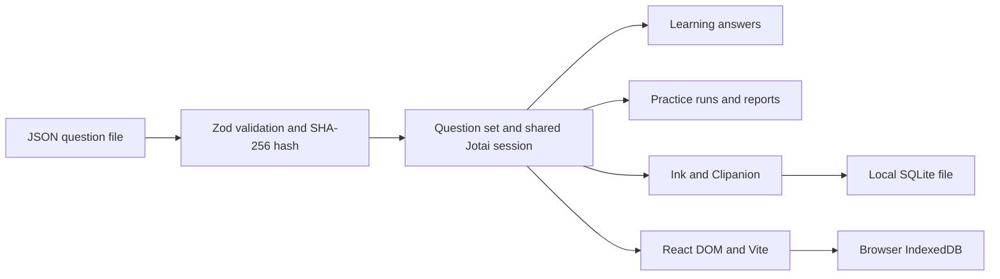

export const title = 'Quizdeck'
export const slug = 'quizdeck'
export const kind = 'Web app & CLI'
export const status = 'active'
export const repo = 'https://github.com/sabinmarcu/quizdeck'
export const npm = '@sabinmarcu/quizdeck'
export const links = { 'quizdeck.sabinmarcu.com': 'https://quizdeck.sabinmarcu.com' }
export const tags = ['project:kind:web-app', 'project:kind:cli', 'project:status:active', 'lang:typescript', 'tool:react', 'tool:ink', 'tool:vite', 'tool:node-js']
export const createdAt = '02.10.2026'
export const modifiedAt = '02.10.2026'

Quizdeck is a local study tool for multiple-choice question sets. The same learning and practice rules are available through a published Ink CLI and a browser app at [quizdeck.sabinmarcu.com](https://quizdeck.sabinmarcu.com). It is not tied to a course or certification; the bundled Demo Set has three questions, and you can replace it with your own JSON file.

## The problem

A question bank is useful for review, but a static list does not remember what you have answered or separate learning from a timed practice run. Quizdeck keeps the question set, learning answers, practice history, and reports locally so you can leave and come back. It does not synchronize progress between the terminal and browser: each has its own store.

## What you can do

- **Learn:** search and filter questions, answer each once, and read the correct choice and the source explanations. Reset learning answers without deleting practice history.
- **Practice:** start a run of up to 60 distinct questions in randomized order, pause active time, resume unfinished runs, and review completed reports.
- **Replace a set:** load a UTF-8 JSON array of questions. Replacement clears the old set's learning answers and practice runs after confirmation when applicable; it does not merge sets.
- **Inspect storage:** see which set is loaded, how many records exist, and where the current interface stores them.

## Where to go next

The [How it works](./quizdeck/how-it-works) page covers validation, state, persistence, and timing. [Shared functionality](./quizdeck/functionalities) walks through studying and loading sets. The [CLI](./quizdeck/cli) and [Web](./quizdeck/web) pages cover their respective controls, setup, and platform limitations.

# !!file How it works

## !slug how-it-works

# How it works

Quizdeck keeps question and progress rules outside its renderers. Both interfaces create their own Jotai application session and use the same question-set validation, learning state, practice transitions, and report construction. Ink renders the session in a terminal; React DOM renders it in a browser. They do not connect to a common server.



## From file to question set

An imported file is a UTF-8 JSON array, not an object with a `questions` property. Each question has a unique positive integer ID, non-blank description, and at least two answers; exactly one answer is correct. Each answer has text, a `correct` boolean, and a `justification` string, which may be empty. Unexpected properties and invalid entries reject the entire file with a location for the error. A blank justification is reported as missing source explanation, not invented by the app.

```json
[
  {
    "id": 1,
    "description": "Which protocol resolves domain names to IP addresses?",
    "answers": [
      { "text": "DNS", "correct": true, "justification": "DNS resolves names to addresses." },
      { "text": "HTTP", "correct": false, "justification": "HTTP transfers web resources." }
    ]
  }
]
```

The set records its source, load time, question count, and a SHA-256 hash of the question content. On first startup, each interface seeds its own copy of the three-question Demo Set only if its store is empty. It never silently replaces an existing set.

## Committing progress

Storage validates snapshots and applies learning answers, practice updates, and set replacement as transactions with a revision check. An answer appears as saved only after the commit succeeds; failed writes leave the previous committed state intact. A replacement is one transaction: it swaps the set and clears learning records, practice runs, timing, and run ownership together. Loading the same file again still clears progress.

Practice records save the selected question IDs and answer order. A new run samples `min(60, question count)` distinct IDs, so the three-question demo produces a three-question run. Completed answers cannot be rewritten; the final committed answer produces a report with score, percentage, elapsed active time, answer outcomes, explanations, and practice-position-to-source-ID mapping.

## Timing and concurrent sessions

The practice clock accumulates active time using a monotonic session clock and durable millisecond checkpoints. Reading and reviewing earlier answers during an active run count; manual pauses, time outside practice, and completed reports do not. A hard crash can lose the last uncheckpointed interval, but does not count the disconnected period. Short-lived writer leases prevent two sessions from updating the same run concurrently; an interrupted lease can briefly delay resumption.

CLI progress lives in a local `node:sqlite` database. Browser progress lives in IndexedDB for that browser profile and origin. Other open instances can refresh committed state, but observation does not grant permission to overwrite an active writer. There is no account, remote sync, or automatic transfer between the two stores.

# !!file Shared functionality

## !slug functionalities

# Shared functionality

Both interfaces present Learn, Practice, and Extras (Overview, Storage, Help). Opening a menu does not mark a question as answered or start a timer. The study rules below are shared even when the controls and storage differ.

## Learn without a timer

Learning lists questions by their source IDs. Search by ID or description and filter All, Unanswered, Completed, Correctly answered, or Incorrectly answered. The completion count describes the whole set, not just the current search results.

Opening a question and moving choice focus do not record progress. Activating a choice saves it and immediately shows correctness and the supplied explanations. If the source has no explanation, Quizdeck says so. An answer is retained when you reopen the question; there is no per-question re-answer or reset. **Reset all learning progress** requires confirmation and removes learning answers only, leaving the current set and all practice runs untouched.

## Practice and reports

Start a run to draw up to 60 distinct questions in a randomized order. Runs are independent and remain in history, so starting another does not replace the previous one. Answering the current question advances to the next unanswered one; you can inspect earlier answers read-only, but cannot skip ahead or change them.

Before completion, practice does not reveal correctness, explanations, a running score, or the original question IDs. The final answer opens a saved report showing each practice position and source ID, selected and correct choices, explanations, correct count, percentage, and elapsed active time. Completed runs remain reviewable after restart. Practice answers do not affect learning status.

Pause and resume an unfinished run. Only active intervals count toward elapsed time. A manual pause stays paused until resumed, including after leaving and returning to practice.

## Load another set

Both interfaces accept the same JSON question format described in [How it works](./how-it-works). Set names come from the filename: `networkBasics.json` becomes **Network Basics**. A successful replacement clears *all* learning answers and *all* practice runs, including finished reports; it is not an append operation. A cancelled or invalid load leaves the current set and records unchanged. Loading in one interface does not replace the other's set.

Extras → Overview shows the loaded set's name, source, load time, question and answer counts, and saved-record counts. Extras → Storage reports the backend, location, retention, revision, and content hash. These are local diagnostics, not a shared account view.

# !!file CLI

## !slug cli

# Terminal interface

The CLI uses Clipanion for commands and Ink for the interactive interface. It needs a terminal for interactive study; `load` can run without one when replacement does not need a prompt or `--yes` is supplied. The packaged executable is `quizdeck` from `@sabinmarcu/quizdeck`.

## Run without installing

Install Node.js 24 before running the published CLI. To launch it in a terminal without adding it to a project:

```sh !package exec --package @sabinmarcu/quizdeck quizdeck
```

The Yarn tab runs it with `yarn dlx`. This fetches the package for this invocation; it does not add it to your project.

## Install the package

In a Node.js project with a package manager installed, add the package:

```sh !package install @sabinmarcu/quizdeck
```

With Yarn, run the installed executable from that project:

```sh
yarn quizdeck
```

## Run from a cloned repository

Development uses Node.js 24.18.0 and Yarn 4.18.1, pinned by Proto in `.prototools`. Install those prerequisites before using repository commands. From the Quizdeck checkout:

```sh
proto install
yarn install
yarn cli
```

`yarn cli` opens the terminal interface, and `yarn cli --help` lists commands. `yarn build` creates the CLI and web builds; `yarn start:cli` runs the built terminal interface. The package also includes Bash, Command Prompt, and PowerShell launchers in `bin/`; they require the built files and installed runtime dependencies beside them. They do not install themselves globally.

## Load a JSON file

From the project where you installed the package, run:

```sh
yarn quizdeck load ./networkBasics.json
yarn quizdeck load ./networkBasics.json --yes
```

With a temporary invocation, use the same `load` arguments after `quizdeck` in the package-manager command above. From a clone, use `yarn cli load ./networkBasics.json` instead.

Relative paths resolve from the caller's working directory. The CLI validates the whole file before opening storage. If progress exists, it prompts for confirmation with Cancel as the default. A non-interactive load with existing progress needs `--yes`; cancellation or validation errors leave the store unchanged and exit non-zero. A successful load reports the new set and cleared record counts, then exits. The required JSON structure is described in [How it works](./how-it-works).

## Navigate and answer

Use arrow keys or `j`/`k` to move, Enter to open or answer, `h`/`l` to move back and forward, and `gg`/`G` to reach menu boundaries. `?` opens Help in the shell; Escape returns to the previous view. `q` or Ctrl-C exits the CLI.

In Learn, `/` focuses search, `f` cycles filters, and `c` clears search outside the editor. In a question, Enter or a letter/number choice shortcut records an answer; focus movement alone does not. `r` opens the confirmed global learning reset. In Practice history, `n` starts a run; `p` pauses or resumes practice. Previously answered practice questions are read-only.

On terminals without enhanced key-release events, holding and repeating the same answer key across consecutive questions is deliberately suppressed. Move focus with `j`/`k` or use a different equivalent key before selecting the same choice again. Exiting an active run saves and pauses it; a hard crash may lose only the last interval since the previous time checkpoint.

On Unix, SQLite is stored under `$XDG_DATA_HOME/quizdeck/progress.sqlite`, or `~/.local/share/quizdeck/progress.sqlite` if that variable is unset. On Windows it uses `%LOCALAPPDATA%\quizdeck\progress.sqlite`, falling back to the user's local AppData directory. The database is not served to the browser.

# !!file Web

## !slug web

# Browser interface

The browser version is a React DOM application built with Vite. It shares Quizdeck's question and progress rules with the CLI, but uses native browser inputs, buttons, dialogs, and IndexedDB. Pointer, touch, Tab navigation, and keyboard shortcuts are supported; shortcuts do not intercept text editing or composition.

## Open the published app

Open [quizdeck.sabinmarcu.com](https://quizdeck.sabinmarcu.com) in your browser. The Demo Set appears on first launch if this browser profile has no saved set.

## Serve it through the CLI

Install Node.js 24 as described on the [CLI page](./cli), then serve the bundled web app without installing the package in a project:

```sh !package exec --package @sabinmarcu/quizdeck quizdeck web
```

Open `http://127.0.0.1:4173`. The command stays in the foreground until Ctrl-C, serves only built assets, and does not open SQLite. If the port is occupied, it fails rather than selecting a different origin.

## Run from a cloned repository

From a checkout with Node.js 24.18.0, Yarn 4.18.1, and Proto available:

```sh
proto install
yarn install
yarn dev:web
```

Vite prints its development URL. To serve the *built* web app through the CLI instead, run:

```sh
yarn build
yarn cli web
```

The `web` command does not build missing assets. A development URL, the local built app's URL, and the published website use separate IndexedDB stores.

## Load a JSON file

Use **Load question set** on Learn, Practice, or Extras, or drop one JSON file onto the ready app. The file picker and confirmation are keyboard operable. A valid file always opens a replacement confirmation; cancelling preserves the old set. Invalid or multiple-file drops show errors rather than navigating away. After a successful replacement, the interface returns to Learn and displays a temporary status message. The accepted JSON structure is described in [How it works](./how-it-works).

## Study and manage sets

Learn offers search, status filtering, and a paginated question list (25 per page by default, with an adjustable positive whole-number page size). Buttons and keyboard navigation open details, choose answers, and return to the list. Question feedback identifies correct and incorrect choices with text as well as color. Reset requires confirmation.

Practice history lets you start or revisit runs, inspect earlier answers, pause, resume, and open completed reports. The browser automatically pauses active timing when the page is hidden, loses focus, or Extras is open; a manual pause does not auto-resume. The current run does not disclose the score or explanations until it is finished.

## Browser storage limits

Quizdeck asks the browser for persistent retention. If that request is denied or unavailable, IndexedDB remains best-effort; clearing site data, private-session teardown, or browser eviction can remove progress. If storage itself is unavailable, startup reports an error rather than pretending that progress can be saved. Browser data is tied to its profile and origin, not to the SQLite data used by `quizdeck` in a terminal.

# !summary

Quizdeck is a local multiple-choice study tool with shared learning and practice rules in an Ink CLI and a React browser app. Each interface stores its own question set, answers, and timed practice reports.