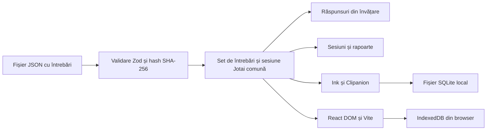

export const title = 'Quizdeck'
export const slug = 'quizdeck'
export const kind = 'Aplicație web și CLI'
export const status = 'active'
export const repo = 'https://github.com/sabinmarcu/quizdeck'
export const npm = '@sabinmarcu/quizdeck'
export const links = { 'quizdeck.sabinmarcu.com': 'https://quizdeck.sabinmarcu.com' }
export const tags = ['project:kind:web-app', 'project:kind:cli', 'project:status:active', 'lang:typescript', 'tool:react', 'tool:ink', 'tool:vite', 'tool:node-js']
export const createdAt = '02.10.2026'
export const modifiedAt = '02.10.2026'

Quizdeck este o unealtă locală de studiu pentru seturi de întrebări cu variante de răspuns. Aceleași reguli pentru învățare și exersare sunt disponibile printr-un CLI Ink publicat ca pachet și într-o aplicație pentru browser la [quizdeck.sabinmarcu.com](https://quizdeck.sabinmarcu.com). Nu este legată de un curs sau de o certificare; Demo Set conține trei întrebări și poate fi înlocuit cu propriul fișier JSON.

## Problema

O colecție de întrebări ajută la recapitulare, dar o listă statică nu reține răspunsurile și nu separă învățarea de o sesiune cronometrată de exersare. Quizdeck păstrează local setul de întrebări, răspunsurile din învățare, istoricul sesiunilor și rapoartele, astfel încât să poți reveni la ele. Nu sincronizează progresul între terminal și browser: fiecare folosește propriul spațiu de stocare.

## Ce poți face

- **Învață:** caută și filtrează întrebările, răspunde o singură dată la fiecare și citește varianta corectă și explicațiile din sursă. Resetează răspunsurile din învățare fără să ștergi istoricul sesiunilor de exersare.
- **Exersează:** începe o sesiune cu cel mult 60 de întrebări distincte în ordine aleatorie, pune cronometrul pe pauză, reia sesiuni neterminate și consultă rapoartele finale.
- **Înlocuiește un set:** încarcă un tablou JSON de întrebări codificat UTF-8. Înlocuirea șterge răspunsurile și sesiunile setului anterior, după confirmare atunci când este necesară; nu combină seturile.
- **Inspectează stocarea:** vezi setul încărcat, numărul de înregistrări și locul unde interfața curentă le păstrează.

## Paginile următoare

Pagina [Cum funcționează](./quizdeck/how-it-works) descrie validarea, starea, persistența și cronometrarea. [Funcționalități comune](./quizdeck/functionalities) prezintă studiul și încărcarea seturilor. Paginile [CLI](./quizdeck/cli) și [Web](./quizdeck/web) acoperă comenzile, pregătirea mediului și limitările fiecărei platforme.

# !!file Cum funcționează

## !slug how-it-works

# Cum funcționează

Quizdeck păstrează regulile pentru întrebări și progres în afara interfețelor. Ambele interfețe creează propria sesiune Jotai și folosesc aceeași validare a setului, aceeași stare pentru învățare, aceleași tranziții pentru exersare și aceeași generare a rapoartelor. Ink afișează sesiunea în terminal; React DOM o afișează în browser. Nu se conectează la un server comun.



## De la fișier la setul de întrebări

Fișierul importat este un tablou JSON codificat UTF-8, nu un obiect cu proprietatea `questions`. Fiecare întrebare are un ID întreg pozitiv și unic, o descriere care nu este goală și cel puțin două variante; exact una este corectă. Fiecare variantă are text, un boolean `correct` și un șir `justification`, care poate fi gol. Proprietățile neașteptate și intrările invalide duc la respingerea întregului fișier, cu indicarea locului erorii. Dacă lipsește explicația, aplicația semnalează lipsa ei, fără să inventeze una.

```json
[
  {
    "id": 1,
    "description": "Which protocol resolves domain names to IP addresses?",
    "answers": [
      { "text": "DNS", "correct": true, "justification": "DNS resolves names to addresses." },
      { "text": "HTTP", "correct": false, "justification": "HTTP transfers web resources." }
    ]
  }
]
```

Setul reține sursa, momentul încărcării, numărul întrebărilor și un hash SHA-256 al conținutului. La prima pornire, fiecare interfață salvează propria copie a setului Demo Set cu trei întrebări, doar dacă spațiul său de stocare este gol. Nu înlocuiește automat un set existent.

## Salvarea progresului

Stocarea validează instantaneele și aplică răspunsurile din învățare, actualizările sesiunilor și înlocuirea setului prin tranzacții cu verificarea reviziei. Un răspuns apare ca salvat doar după finalizarea tranzacției; o scriere eșuată lasă intactă starea salvată anterior. Înlocuirea este o singură tranzacție: schimbă setul și șterge împreună răspunsurile din învățare, sesiunile de exersare, timpii și drepturile de scriere asupra sesiunilor. Reîncărcarea aceluiași fișier șterge și ea progresul.

Înregistrările sesiunilor de exersare păstrează ID-urile întrebărilor selectate și ordinea răspunsurilor. O sesiune nouă alege `min(60, numărul întrebărilor)` ID-uri distincte, deci setul demonstrativ produce o sesiune cu trei întrebări. Răspunsurile finalizate nu pot fi rescrise; ultimul răspuns salvat produce un raport cu scorul, procentul, timpul activ, rezultatele răspunsurilor, explicațiile și corespondența dintre poziția în sesiune și ID-ul din sursă.

## Cronometrare și sesiuni simultane

Cronometrul pentru exersare acumulează timpul activ folosind un ceas monoton al sesiunii și puncte de salvare a milisecundelor. Citirea și revizuirea răspunsurilor anterioare în timpul unei sesiuni active contează; pauzele manuale, timpul petrecut în afara exersării și rapoartele încheiate nu contează. O oprire bruscă poate pierde ultimul interval nesalvat, dar nu adaugă timpul cât aplicația nu a rulat. Drepturile de scriere cu durată scurtă împiedică două instanțe să modifice simultan aceeași sesiune; după o întrerupere, reluarea poate fi refuzată pentru scurt timp.

Progresul din CLI este păstrat într-o bază de date locală `node:sqlite`. Progresul din browser este păstrat în IndexedDB pentru profilul și originea respectivă. Alte instanțe deschise pot prelua modificările salvate, dar observarea lor nu dă dreptul de a suprascrie o sesiune activă. Nu există cont, sincronizare la distanță sau transfer automat între cele două spații de stocare.

# !!file Funcționalități comune

## !slug functionalities

# Funcționalități comune

Ambele interfețe oferă Learn, Practice și Extras (Overview, Storage, Help). Deschiderea unui meniu nu marchează o întrebare ca rezolvată și nu pornește cronometrul. Regulile de studiu de mai jos sunt comune, chiar dacă comenzile și stocarea diferă.

## Învățare fără cronometru

Learn listează întrebările după ID-urile din sursă. Caută după ID sau descriere și filtrează All, Unanswered, Completed, Correctly answered sau Incorrectly answered. Numărul întrebărilor finalizate descrie întregul set, nu doar rezultatele căutării curente.

Deschiderea unei întrebări și mutarea selecției între variante nu înregistrează progres. Alegerea unei variante o salvează și afișează imediat dacă este corectă și explicațiile furnizate. Dacă sursa nu include explicații, Quizdeck spune acest lucru. Răspunsul rămâne înregistrat la redeschiderea întrebării; nu există posibilitatea de a răspunde din nou sau de a reseta o singură întrebare. **Reset all learning progress** cere confirmare și șterge doar răspunsurile din învățare, fără a afecta setul curent sau sesiunile de exersare.

## Exersare și rapoarte

Începe o sesiune pentru a alege până la 60 de întrebări distincte în ordine aleatorie. Sesiunile sunt independente și rămân în istoric, astfel încât o sesiune nouă nu o înlocuiește pe cea anterioară. Răspunsul la întrebarea curentă avansează la următoarea nerezolvată; poți consulta răspunsurile precedente fără a le modifica, dar nu poți sări înainte sau schimba răspunsurile.

Înainte de finalizare, Practice nu dezvăluie corectitudinea, explicațiile, scorul curent sau ID-urile originale ale întrebărilor. Ultimul răspuns deschide un raport salvat care arată fiecare poziție și ID-ul din sursă, variantele alese și corecte, explicațiile, numărul răspunsurilor corecte, procentul și timpul activ. Sesiunile finalizate pot fi consultate și după repornire. Răspunsurile din Practice nu schimbă starea din Learn.

Pune pe pauză și reia o sesiune neterminată. Doar intervalele active intră în timpul total. O pauză manuală rămâne activă până la reluare, inclusiv după ieșirea și revenirea la Practice.

## Încarcă alt set

Ambele interfețe acceptă formatul JSON descris în [Cum funcționează](./how-it-works). Numele setului provine din numele fișierului: `networkBasics.json` devine **Network Basics**. O înlocuire reușită șterge *toate* răspunsurile din învățare și *toate* sesiunile de exersare, inclusiv rapoartele finalizate; nu adaugă întrebări la setul existent. O încărcare anulată sau invalidă lasă setul și înregistrările neschimbate. Încărcarea într-o interfață nu înlocuiește setul din cealaltă.

Extras → Overview arată numele și sursa setului, momentul încărcării, numărul întrebărilor și variantelor și numărul înregistrărilor salvate. Extras → Storage raportează tipul și locul stocării, retenția, revizia și hash-ul conținutului. Sunt informații locale, nu datele unui cont comun.

# !!file CLI

## !slug cli

# Interfața pentru terminal

CLI-ul folosește Clipanion pentru comenzi și Ink pentru interfața interactivă. Studiul interactiv necesită un terminal; comanda `load` poate rula fără unul dacă nu este nevoie de confirmare sau dacă este folosit `--yes`. Executabilul din pachetul `@sabinmarcu/quizdeck` se numește `quizdeck`.

## Rulează fără instalare

Instalează Node.js 24 înainte de a rula CLI-ul publicat. Pentru a-l porni într-un terminal fără a-l adăuga unui proiect:

```sh !package exec --package @sabinmarcu/quizdeck quizdeck
```

Fila Yarn îl rulează prin `yarn dlx`. Această comandă descarcă pachetul pentru rularea curentă; nu îl adaugă proiectului tău.

## Instalează pachetul

Într-un proiect Node.js cu un manager de pachete instalat, adaugă pachetul:

```sh !package install @sabinmarcu/quizdeck
```

Cu Yarn, rulează executabilul instalat din acel proiect:

```sh
yarn quizdeck
```

## Rulează dintr-un repository clonat

Dezvoltarea folosește Node.js 24.18.0 și Yarn 4.18.1, fixate prin Proto în `.prototools`. Instalează aceste programe înainte de a rula comenzile repository-ului. Din directorul proiectului Quizdeck:

```sh
proto install
yarn install
yarn cli
```

`yarn cli` deschide interfața din terminal, iar `yarn cli --help` listează comenzile. `yarn build` construiește versiunile CLI și web; `yarn start:cli` rulează interfața construită. Pachetul conține și lansatoare Bash, Command Prompt și PowerShell în `bin/`; acestea necesită fișierele construite și dependențele instalate alături de ele. Nu se instalează singure la nivel global.

## Încarcă un fișier JSON

Din proiectul în care ai instalat pachetul, rulează:

```sh
yarn quizdeck load ./networkBasics.json
yarn quizdeck load ./networkBasics.json --yes
```

Pentru o rulare temporară, adaugă aceleași argumente `load` după `quizdeck` în comanda cu manager de pachete de mai sus. Dintr-o clonă, folosește în schimb `yarn cli load ./networkBasics.json`.

Căile relative sunt rezolvate din directorul curent al procesului. CLI-ul validează întregul fișier înainte de a deschide stocarea. Dacă există progres salvat, cere confirmare, cu Cancel ca opțiune implicită. O încărcare neinteractivă cu progres existent necesită `--yes`; anularea sau erorile de validare lasă stocarea neschimbată și se încheie cu un cod diferit de zero. O încărcare reușită afișează noul set și numărul înregistrărilor șterse, apoi se încheie. Structura JSON necesară este descrisă în [Cum funcționează](./how-it-works).

## Navighează și răspunde

Folosește săgețile sau `j`/`k` pentru deplasare, Enter pentru deschidere sau răspuns, `h`/`l` pentru înapoi și înainte și `gg`/`G` pentru limitele meniului. `?` deschide Help din meniu; Escape revine la ecranul precedent. `q` sau Ctrl-C închide CLI-ul.

În Learn, `/` activează căutarea, `f` trece prin filtre, iar `c` golește căutarea când editorul nu este activ. La o întrebare, Enter sau o tastă pentru litera/numărul variantei înregistrează răspunsul; simpla deplasare a selecției nu o face. `r` deschide confirmarea pentru resetarea întregului progres de învățare. În istoricul Practice, `n` începe o sesiune; `p` pune pe pauză sau reia exersarea. Întrebările la care ai răspuns deja în Practice pot fi doar citite.

Pe terminalele fără evenimente avansate de eliberare a tastelor, repetarea aceleiași taste de răspuns la întrebări consecutive este blocată intenționat. Mută selecția cu `j`/`k` sau folosește o tastă echivalentă diferită înainte de a alege din nou aceeași variantă. La ieșire, o sesiune activă este salvată și pusă pe pauză; o oprire bruscă poate pierde doar intervalul de după ultima salvare a timpului.

Pe Unix, SQLite se află în `$XDG_DATA_HOME/quizdeck/progress.sqlite` sau, dacă variabila nu este definită, în `~/.local/share/quizdeck/progress.sqlite`. Pe Windows, se află în `%LOCALAPPDATA%\quizdeck\progress.sqlite`, cu o cale alternativă în directorul local AppData al utilizatorului. Baza de date nu este servită browserului.

# !!file Web

## !slug web

# Interfața pentru browser

Versiunea pentru browser este o aplicație React DOM construită cu Vite. Împarte regulile pentru întrebări și progres cu CLI-ul, dar folosește câmpuri, butoane, dialoguri native browserului și IndexedDB. Sunt acceptate mouse-ul, atingerea, navigarea cu Tab și scurtăturile de la tastatură; acestea nu interceptează editarea textului sau compunerea caracterelor.

## Deschide aplicația publicată

Deschide [quizdeck.sabinmarcu.com](https://quizdeck.sabinmarcu.com) în browser. Demo Set apare la prima pornire dacă profilul browserului nu are un set salvat.

## Servește aplicația prin CLI

Instalează Node.js 24 așa cum este descris pe [pagina CLI](./cli), apoi servește aplicația web inclusă fără să instalezi pachetul într-un proiect:

```sh !package exec --package @sabinmarcu/quizdeck quizdeck web
```

Deschide `http://127.0.0.1:4173`. Comanda rămâne activă până la Ctrl-C, servește doar fișierele construite și nu deschide SQLite. Dacă portul este ocupat, se încheie cu eroare în loc să aleagă altă origine.

## Rulează dintr-un repository clonat

Din repository, cu Node.js 24.18.0, Yarn 4.18.1 și Proto disponibile:

```sh
proto install
yarn install
yarn dev:web
```

Vite afișează URL-ul pentru dezvoltare. Pentru a servi în schimb aplicația web *construită* prin CLI, rulează:

```sh
yarn build
yarn cli web
```

Comanda `web` nu construiește fișiere lipsă. URL-ul de dezvoltare, URL-ul aplicației locale construite și site-ul publicat folosesc spații IndexedDB separate.

## Încarcă un fișier JSON

Folosește **Load question set** din Learn, Practice sau Extras, ori trage un singur fișier JSON peste aplicația pregătită. Selectorul de fișiere și confirmarea pot fi folosite de la tastatură. Un fișier valid deschide întotdeauna confirmarea înlocuirii; anularea păstrează setul vechi. Fișierele invalide sau încărcarea mai multor fișiere afișează erori, fără a naviga în altă parte. După înlocuire, interfața revine la Learn și afișează temporar un mesaj de stare. Structura JSON acceptată este descrisă în [Cum funcționează](./how-it-works).

## Studiază și gestionează seturile

Learn oferă căutare, filtrare după stare și o listă paginată de întrebări (implicit 25 pe pagină, cu o dimensiune ajustabilă printr-un număr întreg pozitiv). Butoanele și navigarea de la tastatură deschid detalii, aleg răspunsuri și revin la listă. Feedbackul pentru întrebări identifică variantele corecte și incorecte atât prin text, cât și prin culoare. Resetarea cere confirmare.

Istoricul Practice permite începerea sau revizitarea sesiunilor, citirea răspunsurilor anterioare, pauza, reluarea și consultarea rapoartelor finalizate. Browserul pune automat cronometrul activ pe pauză când pagina este ascunsă, pierde focalizarea sau este deschis Extras; o pauză manuală nu este reluată automat. Sesiunea curentă nu dezvăluie scorul sau explicațiile înainte de finalizare.

## Limitele stocării din browser

Quizdeck solicită browserului stocare persistentă. Dacă solicitarea este refuzată sau nu este disponibilă, IndexedDB rămâne cu retenție nesigură; ștergerea datelor site-ului, închiderea unei sesiuni private sau evacuarea datelor de către browser pot elimina progresul. Dacă stocarea nu este disponibilă deloc, pornirea raportează o eroare în loc să pretindă că progresul poate fi salvat. Datele din browser aparțin profilului și originii sale, nu datelor SQLite folosite de `quizdeck` în terminal.

# !summary

Quizdeck este o unealtă locală de studiu cu întrebări grilă, cu aceleași reguli pentru învățare și exersare într-un CLI Ink și într-o aplicație React pentru browser. Fiecare interfață păstrează separat setul de întrebări, răspunsurile și rapoartele sesiunilor cronometrate.