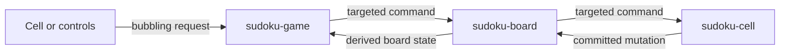

export const title = 'Sudoku Web Components'
export const slug = 'sudoku-web-components'
export const kind = 'Web App'
export const status = 'wip'
export const repo = 'https://github.com/sabinmarcu/sudoku-webcomponents'
export const links = {
  'sudoku.sabinmarcu.com': 'https://sudoku.sabinmarcu.com',
  'sudoku.sabin.app': 'https://sudoku.sabin.app',
}
export const tags = ['project:kind:web-app', 'project:status:active', 'lang:javascript', 'lang:html', 'lang:css', 'tool:web-components', 'tool:vite', 'tool:playwright', 'topics:frontend', 'topics:gaming']
export const createdAt = '13.09.2026'
export const modifiedAt = '13.09.2026'

Sudoku Web Components is a framework-free recreation of the playable area from Sudoku.com Medium. It is a non-commercial proof of concept and an educational reference for an internship program, built to examine how native custom elements, DOM events, and data attributes can support a complete interactive game.

The project covers the game surface rather than the surrounding website. It includes difficulty selection, a responsive 9×9 board, keyboard and pointer input, notes, undo, erase, hints, mistakes, score, a timer, and pause, new-game, win, and game-over dialogs. Navigation, advertising, tracking, store promotion, editorial content, cookie management, and the footer are intentionally excluded.

It is not affiliated with or endorsed by Sudoku.com or Easybrain.

## State in the DOM

Each `<sudoku-cell>` owns its visible state through host data attributes. These include its row, column, box, value, notes, solution, whether it was given by the puzzle, whether it conflicts with a peer, and whether it is selected.

```html
<sudoku-cell
  data-index="12"
  data-row="1"
  data-column="3"
  data-box="1"
  data-value="7"
  data-notes=""
  data-given="false"
  data-error="false"
  data-conflict="false"
  data-selected="true"
></sudoku-cell>
```

CSS reads those attributes to derive selection, row, column, box, matching-number, and conflict styles. The board uses `:has()` selectors for relationships that would otherwise require JavaScript to walk the cells and maintain presentation classes.

Not every value belongs in markup. Undo history, interval handles, observers, and asynchronous generation tokens remain private JavaScript state. The experiment is about making inspectable DOM state useful, not forcing every implementation detail into an attribute.

## Events as the component boundary

The application uses four custom elements: `<sudoku-game>`, `<sudoku-board>`, `<sudoku-cell>`, and `<sudoku-controls>`. Each creates an open shadow root and keeps references to permanent DOM nodes rather than rebuilding a component tree after every action.

Requests from cells and controls bubble upward through composed events. The game sends commands downward by dispatching targeted events on the board, which routes cell-specific commands to the selected or indexed cell. After changing its own attributes, a cell emits a mutation event with complete before and after snapshots.



This is not a broadcast event bus. Components do not call behavioral methods on siblings, and `document` is not used to route application commands. Direction is explicit because DOM events naturally bubble toward ancestors but do not propagate from an ancestor into its descendants.

## Granular updates

There is no virtual DOM, general `render()` method, or synchronize-everything pass. A cell updates its cached value node, note slots, error state, conflict state, and accessible name only when the relevant concern changes. The board separately recalculates conflicts, empty-cell count, and solved state after committed mutations.

Keyboard input and on-screen controls enter the same mutation path. Undo restores the recorded before snapshot without recording another mutation. Correct values remove the same candidate from peer notes. Given cells reject changes, and the game stops accepting input outside the `playing` state.

Puzzle generation and solving use a pinned copy of `robatron/sudoku.js` inside a classic Web Worker. Generation therefore does not block the interface, and the application validates that the worker returns an 81-character puzzle and solution before applying them.

## Current scope

The current implementation supports six difficulty levels, responsive desktop and compact controls, arrow-key navigation, number input, notes mode, erase, undo, hints, duplicate highlighting, three-mistake loss, pause and resume, and exact-solution win detection. Playwright exercises these paths in a browser and checks desktop geometry and mobile overflow.

The project remains under development. It is a focused implementation study rather than a general Sudoku engine, reusable component package, or commercial replacement for the reference site.

# !summary

A non-commercial Sudoku.com game-surface recreation built with native Web Components. DOM data attributes expose visible state, while bubbling requests and targeted events coordinate granular updates without a UI framework or virtual DOM.