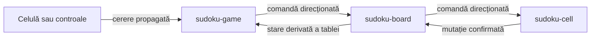

export const sourceHash = 'b258bb2700f31055c1d359b8af292d6c9fe107185e17e8e37a74af2aab5994b8'


export const title = 'Sudoku Web Components'
export const slug = 'sudoku-web-components'
export const kind = 'Web App'
export const status = 'wip'
export const repo = 'https://github.com/sabinmarcu/sudoku-webcomponents'
export const links = {
  'sudoku.sabinmarcu.com': 'https://sudoku.sabinmarcu.com',
  'sudoku.sabin.app': 'https://sudoku.sabin.app',
}
export const tags = ['project:kind:web-app', 'project:status:active', 'lang:javascript', 'lang:html', 'lang:css', 'tool:web-components', 'tool:vite', 'tool:playwright', 'topics:frontend', 'topics:gaming']
export const createdAt = '13.09.2026'
export const modifiedAt = '13.09.2026'

Sudoku Web Components este o recreare fără framework a zonei de joc din Sudoku.com Medium. Este un proof of concept necomercial și o referință educațională pentru un program de internship, construit pentru a examina cum pot elementele personalizate native, evenimentele DOM și atributele de date să susțină un joc interactiv complet.

Proiectul acoperă suprafața jocului, nu site-ul din jurul acesteia. Include selectarea dificultății, o tablă 9×9 responsivă, control prin tastatură și pointer, notițe, anulare, ștergere, indicii, greșeli, scor, cronometru și dialoguri pentru pauză, joc nou, câștig și pierdere. Navigarea site-ului, publicitatea, monitorizarea, promovarea magazinului, conținutul editorial, gestionarea cookie-urilor și subsolul sunt excluse intenționat.

Nu este afiliat cu și nu este susținut de Sudoku.com sau Easybrain.

## Starea în DOM

Fiecare `<sudoku-cell>` își deține starea vizibilă prin atribute de date pe elementul gazdă. Acestea includ rândul, coloana, caseta, valoarea, notițele, soluția, dacă valoarea a fost oferită de puzzle, dacă intră în conflict cu un element asociat și dacă este selectat.

```html
<sudoku-cell
  data-index="12"
  data-row="1"
  data-column="3"
  data-box="1"
  data-value="7"
  data-notes=""
  data-given="false"
  data-error="false"
  data-conflict="false"
  data-selected="true"
></sudoku-cell>
```

CSS citește aceste atribute pentru a deriva stilurile de selecție, rând, coloană, casetă, număr identic și conflict. Tabla folosește selectori `:has()` pentru relații care altfel ar necesita ca JavaScript să parcurgă celulele și să mențină clase de prezentare.

Nu orice valoare aparține marcajului. Istoricul pentru anulare, identificatorii intervalelor, observatorii și tokenurile de generare asincronă rămân stare JavaScript privată. Experimentul urmărește folosirea unei stări DOM inspectabile, nu forțarea fiecărui detaliu de implementare într-un atribut.

## Evenimentele ca limită între componente

Aplicația folosește patru elemente personalizate: `<sudoku-game>`, `<sudoku-board>`, `<sudoku-cell>` și `<sudoku-controls>`. Fiecare creează un shadow root deschis și păstrează referințe către noduri DOM permanente în loc să reconstruiască un arbore de componente după fiecare acțiune.

Cererile celulelor și controalelor urcă prin evenimente compuse care se propagă. Jocul trimite comenzi în jos prin evenimente direcționate către tablă, care transmite comenzile specifice către celula selectată sau indexată. După modificarea propriilor atribute, o celulă emite un eveniment de mutație cu instantanee complete înainte și după.



Acesta nu este un event bus cu difuzare. Componentele nu apelează metode comportamentale pe componentele vecine, iar `document` nu este folosit pentru a ruta comenzile aplicației. Direcția este explicită deoarece evenimentele DOM urcă în mod natural spre strămoși, dar nu se propagă de la un strămoș către descendenții săi.

## Actualizări granulare

Nu există DOM virtual, metodă generală `render()` sau etapă de sincronizare completă. O celulă își actualizează nodul memorat pentru valoare, pozițiile notițelor, starea de eroare, starea de conflict și numele accesibil doar când se schimbă aspectul relevant. Tabla recalculează separat conflictele, numărul celulelor goale și starea rezolvată după mutațiile confirmate.

Intrarea de la tastatură și controalele de pe ecran folosesc același traseu de mutație. Anularea restaurează instantaneul anterior înregistrat fără a înregistra altă mutație. Valorile corecte elimină același candidat din notițele celulelor asociate. Celulele date resping modificările, iar jocul nu mai acceptă intrări în afara stării `playing`.

Generarea și rezolvarea puzzle-urilor folosesc o copie fixată a `robatron/sudoku.js` într-un Web Worker clasic. Astfel, generarea nu blochează interfața, iar aplicația validează că worker-ul returnează un puzzle și o soluție cu 81 de caractere înainte de a le aplica.

## Domeniul actual

Implementarea curentă suportă șase niveluri de dificultate, controale responsive pentru desktop și format compact, navigare cu săgețile, introducerea numerelor, modul de notițe, ștergere, anulare, indicii, evidențierea duplicatelor, pierdere după trei greșeli, pauză și reluare și detectarea câștigului prin soluția exactă. Playwright exercită aceste trasee într-un browser și verifică geometria pe desktop și depășirea pe mobil.

Proiectul este încă în dezvoltare. Este un studiu de implementare concentrat, nu un motor Sudoku general, un pachet de componente reutilizabile sau un înlocuitor comercial pentru site-ul de referință.

# !summary

O recreare necomercială a suprafeței de joc Sudoku.com, construită cu Web Components native. Atributele de date DOM expun starea vizibilă, iar cererile propagate și evenimentele direcționate coordonează actualizări granulare fără framework UI sau DOM virtual.